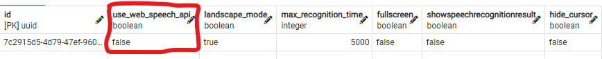

# GoogleSpeechToTextついて
Googleが提供するGoogleSpeechToTextを使ってサーバー側でGoogleCloud/speechを通してデータの送受信を行っています。

一連の流れ：

1. ブラーザ側でユーザーからの音声を取得、サーバー側に送信。
2. ブラーザからの音声データをGoogleCloudに送信。
3. GoogleCloudで音声解析された後、テキスト形式でサーバーに戻ってくる。
4. SPJで関連動画ID取得、フロントに動画IDと一緒に関連情報を送信。

# マイクのオンオフ
フロントでの音声バッファー作成のためにブラーザが提供するメディアプレイヤーを利用しています。

マイクオン時：
ブラーザのマイクがオン、音声バッファー作成開始、そしてGoogleSpeechToTextとをスタートさせる。

マイクオフ時：
GoogleSpeechToTextをオフ、ブラーザのマイクをオフにする。

動画情報のマイク設定を確認して、マイクのオンオフが決まります。

# GoogleSpeech最大接続可能時間対策
現状、GoogleSpeechToTextのオーディオストリーム接続可能時間が約4分なので、その対策としてタイマーを作成しました。オーディオストリームのスタート時間を取得して4分ごとにストリームを停止し再接続することで接続可能時間に対応しました。

# react hook
ブラーザ音声認識が提供するtranscript, finalTranscript, resetTranscript, listening, startListening, stopListeningに対応するためuseGoogleSpeechRecognition.tsを作成しSpeechToText.tsxとVideoPlayer.tsxで利用できるよう同じ機能を作成しました。

# Google Speech設定方法
1. pgAdminに入り、project_settingsテーブルのuse_web_speech_apiの設定を変更して下さい。
   * use_web_speech_apiがfalseの場合、Google Speech To Textを利用。
   * use_web_speech_apiがtrueの場合、Web Browser Speech To Textとなります。
  
   

2. 下の図を参考にしながらconfig/google_key.jsonを作成し、googleSpeechのkeyの中身をコピーして入れてください。
   
   

3. 作成したgoogle_key.jsonのパスを.env.localに追加してください。

```
GOOGLE_APPLICATION_CREDENTIALS = './config/google_key.json'
```