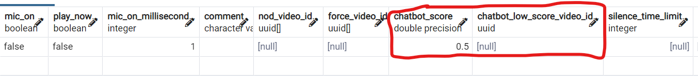

# チャットボットスコアついて
SPJのスコアが低かった動画を表示しない処理

一連の流れ：

1. ブラーザ側で音声解析されたテキストを取得、サーバー側に送信。
2. 取得したテキストをspj側に送る
3. spjからのデータを解析し、videosテーブルの動画IDのchatbot_score（0.1 - 1.0のスケール）を確認。
4. user_settingsテーブル、ユーザー毎のchatbot_score（0.1 - 1.0のスケール）を確認。
5. 動画情報をブラーザ側に返信。

# videosテーブルの設定方法
  spjのスコアが個々の動画のチャットボットスコアより低い場合の処理。

  chatbot_score: 0.1 - 1.0のスケール

  chatbot_low_score_video_id: スコアが低かった時に再生したい動画IDを入れてください。*chatbot_low_score_video_idが空の場合、何も処理されません。

  

# user_settingsテーブル
　spjのスコアが選択したパートナーのチャットボットスコアより低い場合の処理。

  chatbot_score: 0.1 - 1.0のスケール

  chatbot_low_score_video_id: スコアが低かった時に再生したい動画IDを入れてください。*chatbot_low_score_video_idが空の場合、何も処理されません。

  

# 管理画面のエラーログに表示
　spjのスコアがチャットボットスコアより低い場合、下記のように表示されます。

* 選択したパートナーのチャットボットスコアより低い場合

* 個々の動画のチャットボットスコアより低い場合
