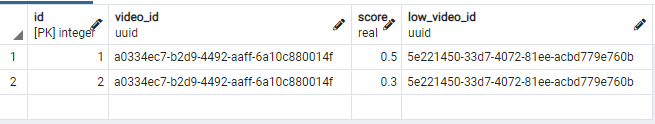
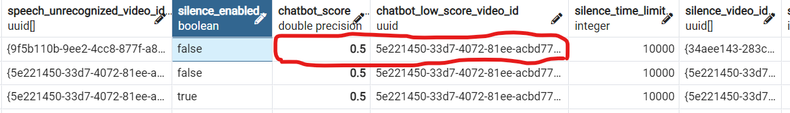
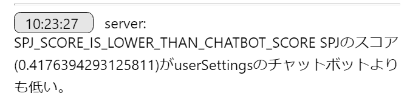
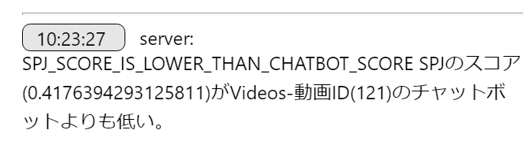

# チャットボットスコアついて
SPJのスコアが低かった動画を表示しない処理

一連の流れ：

1. ブラーザ側で音声解析されたテキストを取得、サーバー側に送信。
2. 取得したテキストをspj側に送る
3. spjからのデータを解析し、Chatbot_scoresテーブルの動画IDのchatbot_score（0.1 - 1.0 のスケール）を確認。
4. user_settingsテーブル、ユーザー毎のchatbot_score（0.1 - 1.0 のスケール）を確認。
5. 動画情報をブラーザ側に返信。

# Chatbot_scoresテーブルの設定方法
* spjのスコアが個々の動画のチャットボットスコアより低い場合の処理。　
* 個々の動画用のチャットボットスコア判定のデータを保持するChatbot_scoresテーブル作成。

```sql
CREATE TABLE chatbot_scores (
	id SERIAL PRIMARY KEY,
	video_id uuid REFERENCES videos(id) ON DELETE CASCADE,
	score FLOAT(2) CHECK(score BETWEEN 0 AND 1),
	low_video_id uuid REFERENCES videos(id)
);
```
* id - 自動作成される番号
* video_id - スコア判定したい動画のID
* score: 0.1 - 1.0のスケール
* low_video_id - spjスコアがチャットボットスコアより低かった場合に流す動画

  


# user_settingsテーブル
　spjのスコアが選択したパートナーのチャットボットスコアより低い場合の処理。

  chatbot_score: 0.1 - 1.0のスケール

  chatbot_low_score_video_id: スコアが低かった時に再生したい動画IDを入れてください。*chatbot_low_score_video_idが空の場合、何も処理されません。

  

# 管理画面のエラーログに表示
　spjのスコアがチャットボットスコアより低い場合、下記のように表示されます。

* 選択したパートナーのチャットボットスコアより低い場合


* 個々の動画のチャットボットスコアより低い場合


# Chatbot_scoresテーブル追加　（更新日10/4)

 Chatbot_scoresテーブルでの2段回spjスコア判定機能を追加。

 例）スコア判定を２段階設定することでスコアによって流す動画を切り替えることができます。

 　一段階スコア：0.3未満

 　二段階スコア：0.6未満
　　＊スコアが低いものから判定スタート。
   
   spjからのスコアが0.5だった場合、一段階突破、二段階目で設定されたらlow_video_idの動画が流れます。

videosテーブルのchatbot_scoresに追加。スコアの順番は関係なし。
```sql
Insert Into chatbot_scores (video_id, score, low_video_id) 
values (判定スコアつけたいvideoのID,　判定スコア,　ロースコア用のvideoのID),
(判定スコアつけたいvideoのID,　判定スコア,　ロースコア用のvideoのID);
```


