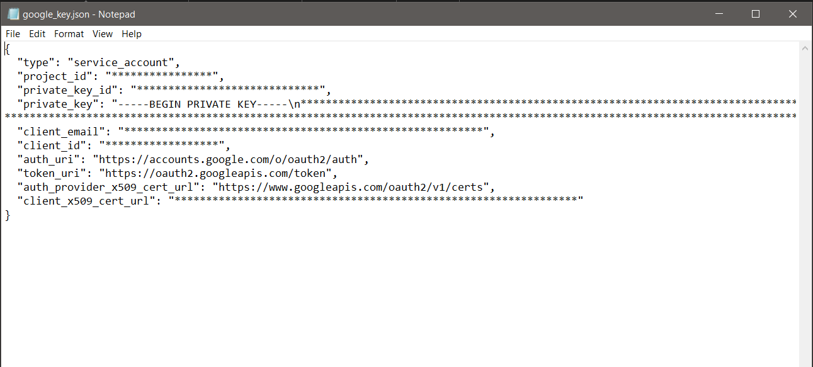
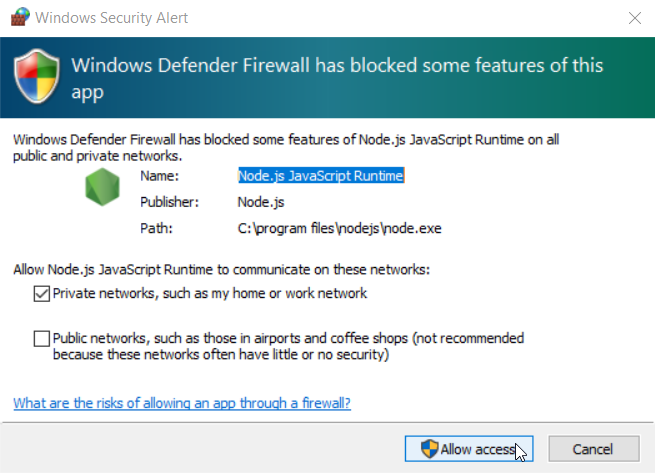
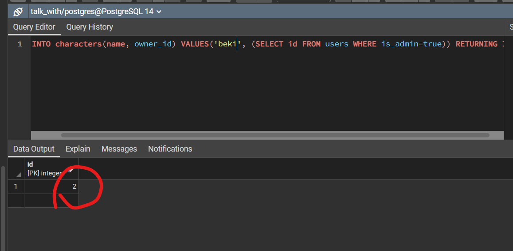
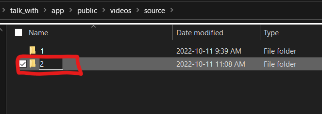
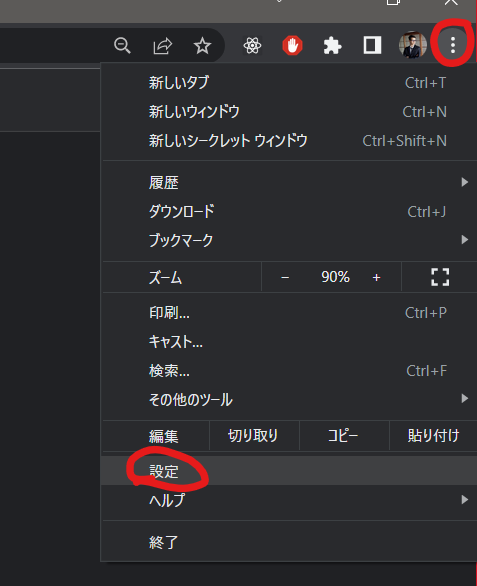
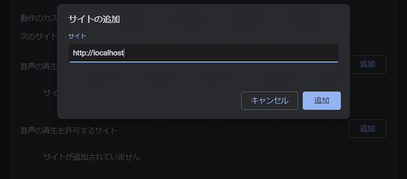

初めてTalk Withのon-premise版をパソコンで動くようにするには必要なプログラムをインストールしないといけないです。必要なプログラムのインストールは最初の一回だけ行います。[PCの初期セットアップ（新しいPCに入れる場合のみ）](#PCの初期セットアップ（新しいPCに入れる場合のみ）)をご覧ください。  
👆必要なプログラムのインストールが終わったら、Talk WithのソースをPCに入れて動かします。[ソースコードの導入（talk-withシステムのソースのアップデート方法）](#ソースコードの導入（talk-withシステムのソースのアップデート方法）)をご覧ください

# PCの初期セットアップ（新しいPCに入れる場合のみ）
- `NodeJS` のインストール => [NodeJSのインストール方法](./how_to_install_node.md) に従ってください。
- `Git` のインストール => [Gitのインストール方法](./how_to_install_git.md) に従ってください。  
- `PostgreSQL`データーベースのインストール => [PostgreSQLのインストール方法](./how_to_install_pg.md) に従ってください。
  - インストールが終わったら、`talk_with`データーベースを作成してください。作成方法は[データーベースの作り方](./how_to_install_pg.md/#データーベースの作り方)に従ってください。
- `OpenSSH` セットアップ => [OpenSSHの方法](./how_to_setup_openssh.md#OpenSSH) に従ってください。
  - セットアップが終わりましたら、提供されたSSHキーペアーをセットアップしてください。 => [既に存在するSSHキーペアーのセットアップ](./how_to_setup_openssh.md#既に存在するsshキーペアーのセットアップ) に従ってください。
- `FFMPEG` セットアップ => [ffmpegの方法](./how_to_install_ffmpeg.md) に従ってください。
- 上の全部インストール終わったら、PC再起動してください。

> ダウンロードリンクが動かない場合は、開発者からダウンロードファイルを問い合わせください。

# ソースコードの導入（talk-withシステムのソースのアップデート方法）
## STEP 1 - SPJとpostgresqlの接続設定
> ⚠ このステップにはソースコードアクセス用のsshキーの設定が必要です。[既に存在するSSHキーペアーのセットアップ](./how_to_setup_openssh.md#既に存在するsshキーペアーのセットアップ) に従ってください。
1. `init_talk_with.bat`ファイルを実行してください。
2. `init_talk_with.bat`のプロセスが一時的に中止し、`notepad`アプリが開かれます。そこに、
   1. `PGSQL_PASSWORD` => PostgreSQLをインストールした時に設定した`マスターパスワード`
   2. `SPJ_API_KEY` => SPJのAPIキー
   3. `SPJ_API_URL` => SPJのAPIのURL
   4. `SPJ_CATEGORY_ID` => SPJのカテゴリーIDを入力してください（必要なかったらそのまま）。
3. `notepad`で入力終わったら`Ctrl+S`で保存し、`notepad`を閉じてください。（バッチが次のステップに行きます。行かない場合は`Enter`キーを押してください。）
## STEP 2 - 動画ファイルのコピー
1. Step1の３が進んだら、ファイルエクスプローラーが開かれます。そちらに「鈴木先生」の動画ファイルを全てコピーしてもってきて、エクスプローラー閉じてください。（バッチが次のステップに行きます。行かない場合は`Enter`キーを押してください。）
## STEP 3 - Google Cloudキーの設定
1. STEP 2が進んだら、`notepad`でGoogle CloudのSpeech to Text用のキーの保存用のファイルが開かれます。そちらに、Googleのキーを入力し、`Ctrl+S`で保存し、`notepad`を閉じてください。（バッチが次のステップに行きます。行かない場合は`Enter`キーを押してください。）  
> クラウドキーのサンプルについて以下をご参照ください：
2. `init_talk_with.bat`のプロセスが再開されます。終了までお待ちください。
## Step 4 - Windows Firewallの許可
1. Windows Security Alert画面が出ます。`Allow Access`というボタンを押してください。  
  
2. バッチが終了するまで、しばらくお待ちしてください。終了したらブラウザでtalk_withアプリが開かれます。

> 注意点：スタートを押したら、自動再生するには、`chrome`の設定で`localhost`に許可を与えないといけないです。[自動再生許可の設定](#自動再生許可の設定)に従ってください。

# キャラクターの追加方法
- 以下のコマンドをコピーし、`pgAdmin`でキャラクターを作成してください。`キャラクター名`の部分を追加したいキャラクター名に変更してください。
> pgadminの使い方については「[SQLコマンドで操作方法](./how_to_install_pg.md#SQLコマンドで操作方法)」に従ってください。
  ```sql
  INSERT INTO characters(name, owner_id) VALUES('キャラクター名', (SELECT id FROM users WHERE is_admin=true)) RETURNING ID;
  ```
- 実行したら、キャラクターのIDが以下のように返されます：
- そのIDをメモって置いてください。

## 動画ファイル
- *メモしたID*で`talk_with/app/public/videos/source`の中にフォルダーを作成し、そのフォルダーにキャラクターの動画を入れてください。

## キャラクターの動画設定（csv）
- 設定ファイルの名前を`videoSettingFile.csv`にしてください。
- メモしたIDを`videoSettingFile.csv`の`character_id`に設定してください。
- `videoSettingFile.csv`の２行目に以下を無ければ追加してください。
  ```txt
  original_id, character_id, title, action, loop_count, original_next_id, mic_on, play_now, mic_on_millisecond, question, comment
  ```
- ソースコードのパスの `C:/talk_with/docs/`フォルダーに`videoSettingFile.csv`を保存。（後で管理画面からアップロードできるようになる）
- ターミナルで`insertData.bat`を実行。
> バッチは `C:\talk_with\`に存在します。


# videoSettingFile.csvについて
## データーの形（必須）
1. ２行目に以下であること
  ```txt
  original_id, character_id, title, action, loop_count, original_next_id, mic_on, play_now, mic_on_millisecond, question, comment
  ```
2. ファイル名が`videoSettingFile.csv`であること
3. キャラクターID（character_id）にデータベースに登録したキャラクターのIDを設定すること
4. フラグ系の項目（`mic_on, play_now, question`）などの値としては、`true`か`false`か`TRUE`か`FALSE`のいずれを入れてください。
## 動画設定について
以下のように動画名と設定ファイルを合わせれば、自動でデータベースにキャラクターのスタート動画、うなずき動画、無音時の動画、認識できないときの動画などが登録される。
1. スタート動画のタイトルは`start.mp4`であること、かつ、character_idが設定されていること
2. うなずき動画のタイトルは`listen.mp4`であること、かつ、character_idが設定されていること
3. 認識できない音の動画のタイトルは`unrecognized.mp4`であること、かつ、character_idが設定されていること
4. 無言時に再生する動画のタイトルは`silence.mp4`であること、かつ、character_idが設定されていること
5. 連続無言時に再生する動画のタイトルは`out.mp4`であること、かつ、character_idが設定されていること
6. SPJ判定スコアが低い時に再生する動画のタイトルは`spjlow.mp4`であること、かつ、character_idが設定されていること


# SPJの設定について
`talk_with/app`の中に`.env.local`ファイルがあります。
`.env.local`ファイルに以下を設定する：
```bash
SPJ_API_KEY = SPJのAPIキー
SPJ_CATEGORY_ID = カテゴリ別で検索する場合のカテゴリID、検索しない場合は空白
SPJ_API_URL = SPJのAPIのURL(最後の部分は/retrieve?で終わること)
```

# 機能の一覧  
* [DB構成](./DB.md)
* [管理画面の説明](./admin_page.md)  
* [[ β-2 ] 無言の設定](./how_to_setup_silence_limit.md)
* [[ β-10 ] conversation_countの設定](./how_to_setup_conversation_count.md)
* [[ β-29 ] pattern](./how_to_setup_pattern.md)
* [自動認証機能](./LogDB_with_Authentication.md)
* [replacement_list 動画ID/変換ID](./how_to_setup_alternative_list.md)
* [fullscreen](./how_to_setup_fullscreen.md)
* [google音声認識](./About_GoogleSpeechToText.md)
* [hide_cursor](./how_to_setup_hide_cursor.md)
* [hit_words](./how_to_setup_hit_words.md)
* [landscape_mode (縦横設定）](./how_to_setup_landscape_mode.md)
* [max_recognition_time](./how_to_setup_max_recognition_time.md)
* [show_speech_recognition_result](./how_to_setup_show_speech_recognition_result.md)
* [spj_category](./how_to_setup_spj_category.md)
* [tag（回答タグ）](./how_to_setup_tag.md)
* [管理者画面のSTOPボタン](./admin_stop_button.md)
* [チャットボットスコア判定について](./About_chatbotScore.md)
* [ランダム再生](./how_to_setup_random.md)
* [まとめモード](./how_to_setup_matome.md)
* [聞き忘れモード](./how_to_setup_kikiwasure.md)
* [強制再生](./how_to_setup_force_video.md)
* [on-premiseモード](./how_to_switch_on-premise_mode.md)


# 自動再生許可の設定
ブラウザはセキュリティー上で、動画の自動再生するにはユーザーが先に操作しないと再生しないです。自動再生がうまくいくためには、`talk with`が動いているドメインの許可を入れないといけないです。いかに従ってください。
1. chromeの設定ページを開いてください。  
   
2. `プライバシーとセキュリティー`を選択してください。
3. `サイトの設定`をクリックしてください。
4. 一番下の`その他のコンテンツの設定`をクリックしてください。
5. `音声`を選択してください。
6. 音声の再生を許可するサイトの「`追加`」ボタンをクリックしてください。
7. `http://localhost`を入れて、「`追加`」をしてください。
   
8. ブラウザを再起動してください。