# 管理画面についてとは

`管理画面について`とは、管理画面の全体的な説明です。

# プロジェックと設定

機能|内容
----|-----
[use_web_speech_api](./About_GoogleSpeechToText.md)|web又はgoogle音声認識を選択する機能
[landscape_mode](./how_to_setup_landscape_mode.md)|横縦モードの機能
[max_recognition_time](./how_to_setup_max_recognition_time.md)|ユーザーが言い終わってから時間を測る機能
[show_speech_recognition_result](./how_to_setup_show_speech_recognition_result.md)|マイク及びテキストの表示/非表示するかの機能
[hide_cursor](./how_to_setup_hide_cursor.md)| マウスカーソルを表示/非表示するかの機能
standby_video_id | 待機動画のID

* 更新したい項目がある場合、データを記入して更新ボタンを押してください。  
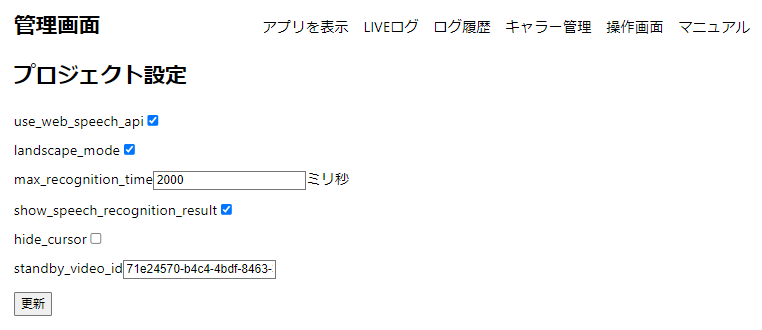

# アプリを表示
* アプリを表示のボタンをクリックするとtalk-withのアプリが開かれます。  
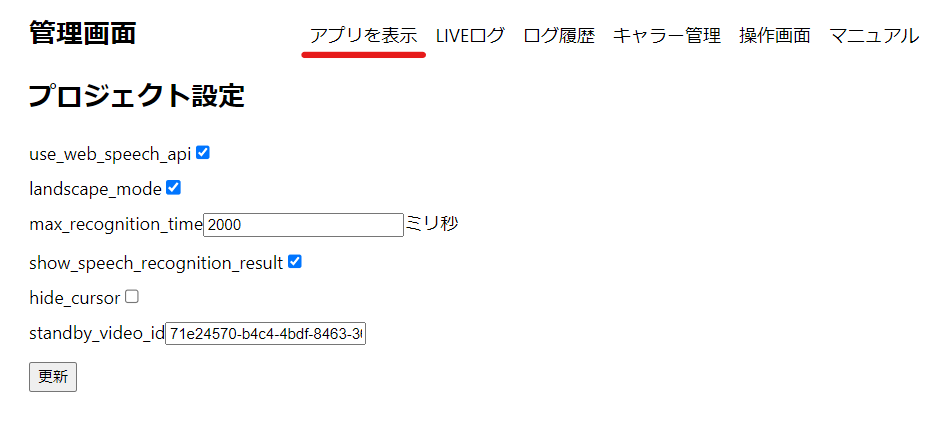  
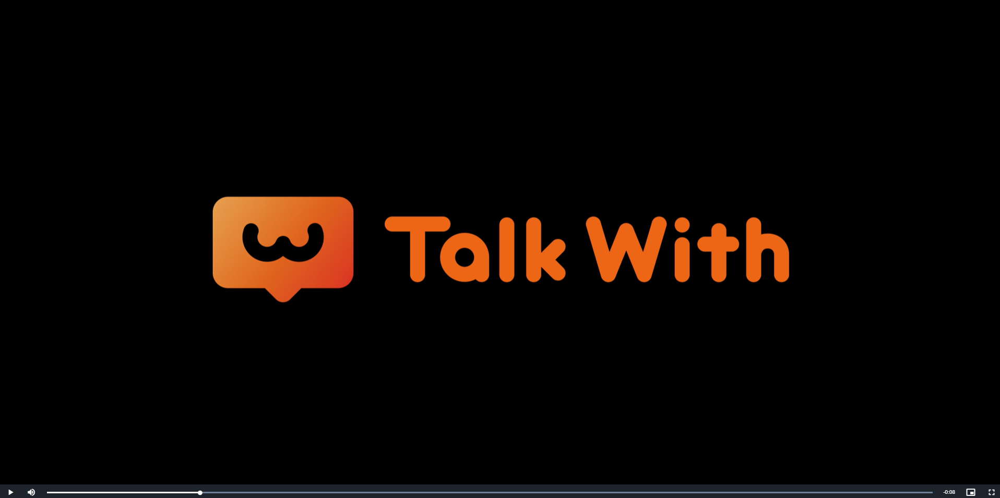  

# LIVEログ
* 再生されている状況・動画のデータ・エラーをライブで確認できるページです。(データはデータベースに保存されるので、ログ履歴で確認できます。)  
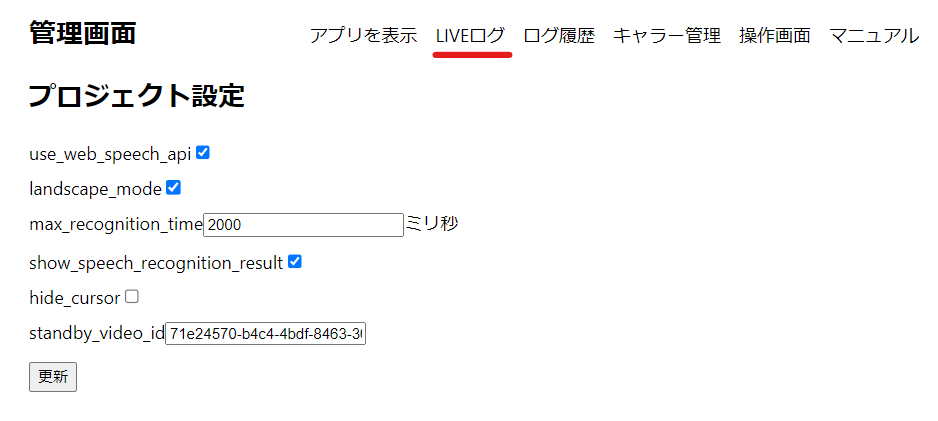　　
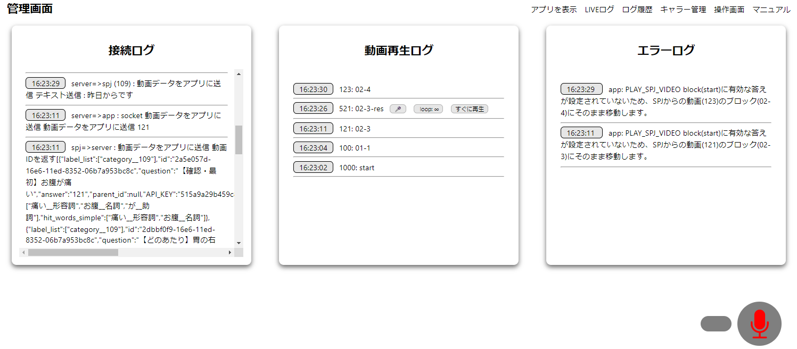　　
  
# ログ履歴
* 保存されたログを確認できるページです。
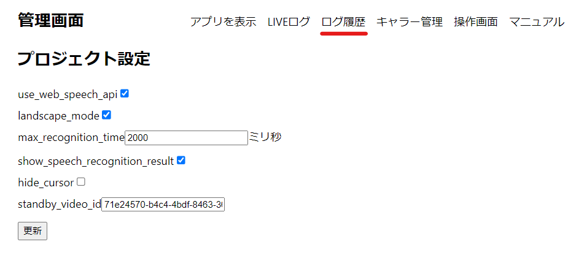　　
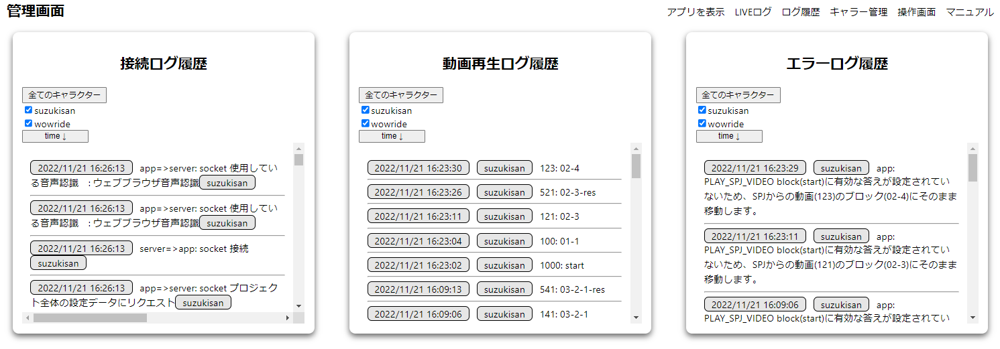　　

# キャラー管理
* キャラクターセッティングを管理するページです。
   ([キャラクターセッティング](./how_to_setup_character_admin_page.md)を更新したい場合参考にしてください。)
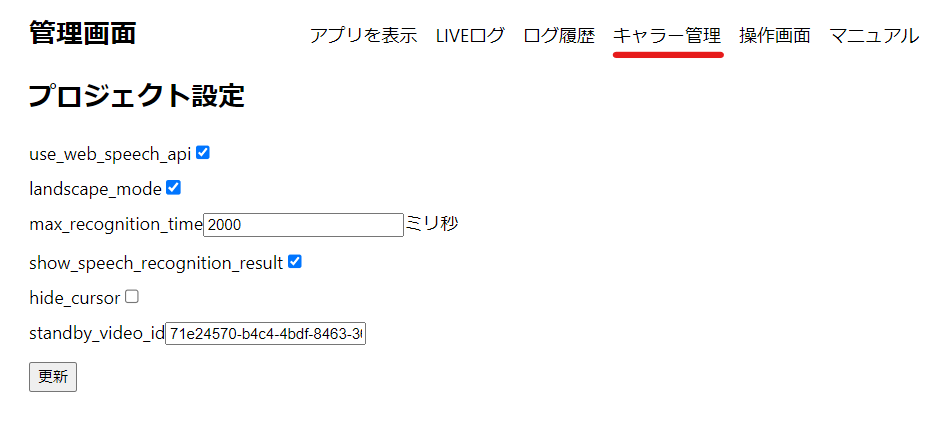　　
　　

# 操作画面
* 再生するキャラクターの選択及び動画停止をコントロールするページです。  
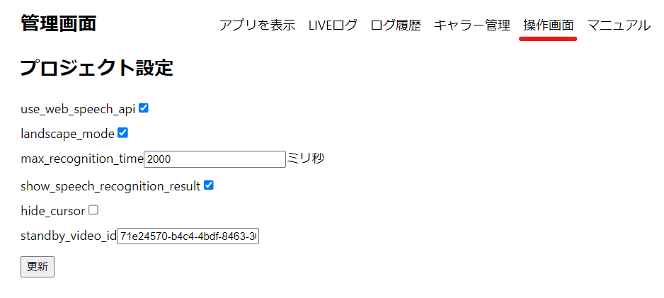　　
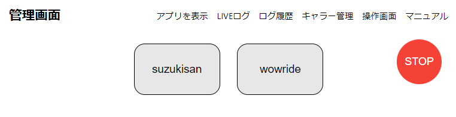　　

# マニュアル
* ブラウザでtalk-withのマニュアルを見れるボタンです。  
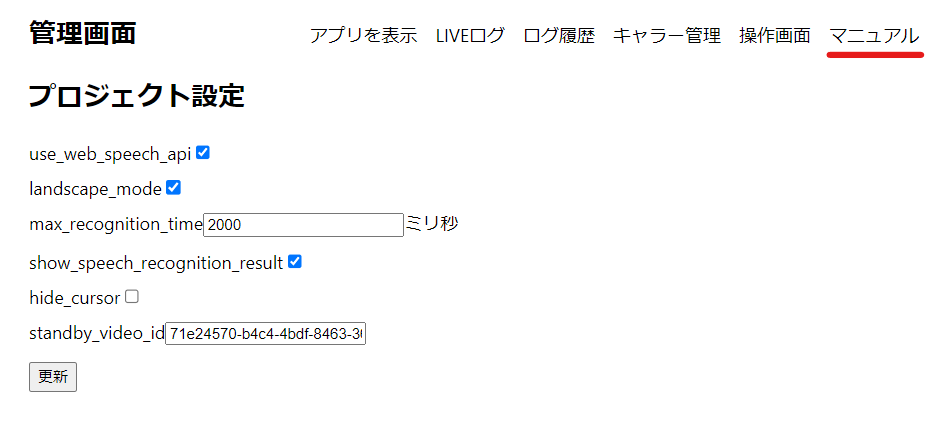　　
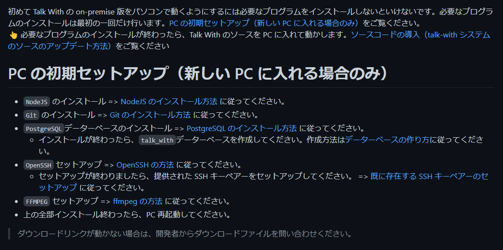　　
