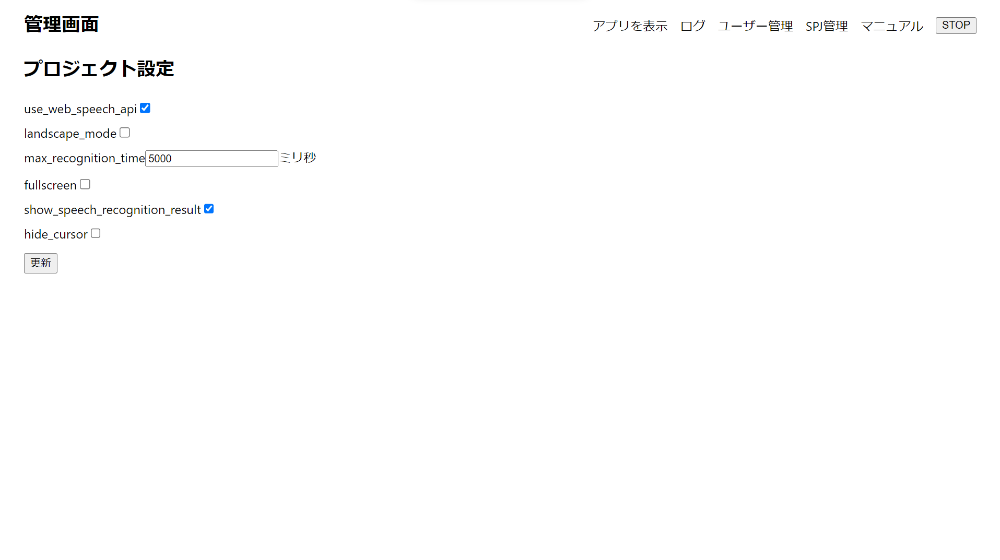
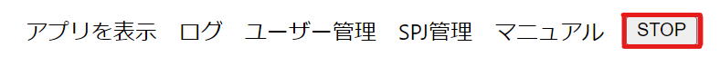
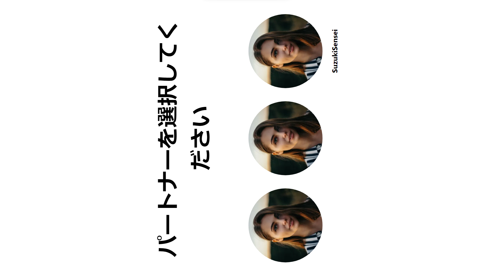

# 管理画面のSTOPボタンとは
  
`管理画面のSTOPボタン`とは、 管理者画面（localhost:3000/amdmin）であるボタンでユーザーが見ている画面（動画再生中が前提）を強制的にキャラクターを選択する画面に移動させる機能です。

# 使い方
1. 管理者ページを開きます。（ localhost:3000/admin ）
   
2. 右上のメニューのSTOPボタンを押します。
   
3. ユーザーが見ている画面Aから画面Bに強制的に移動します。  
   [画面A]
   
   [画面B]
   

