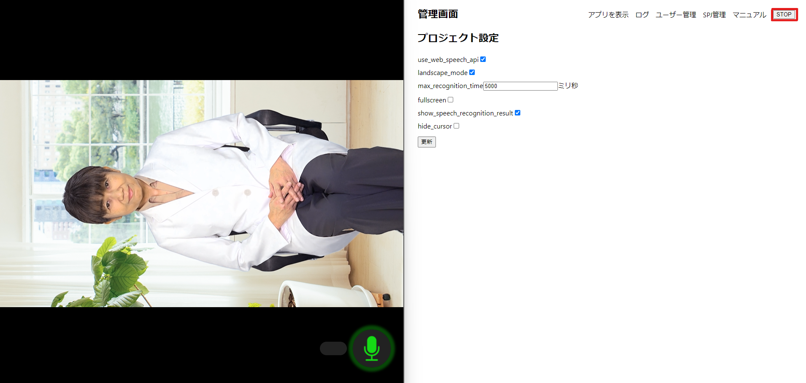
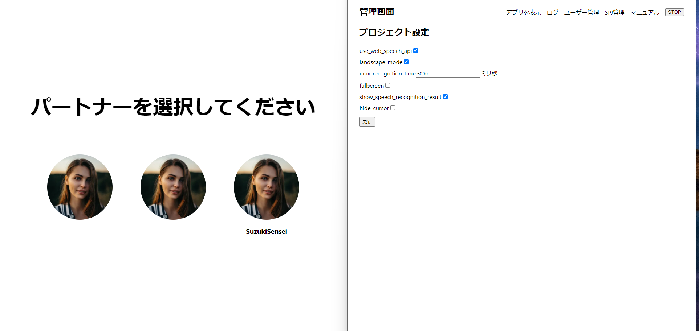

# 管理画面のSTOPボタンとは
  
`管理画面のSTOPボタン`とは、 管理者画面（localhost:3000/amdmin）であるボタンでユーザーが見ている画面（動画再生中が前提）を強制的にキャラクターを選択する画面に移動させる機能です。

# 使用方法

１．画像の左側（ユーザー画面）、画像の右側（管理画面）    
２．管理画面でSTOPボタンを押すと、ユーザーが見ている画面（動画再生中が前提）を強制的にキャラクターを選択する画面に移動します。   

[STOPボタン押す前]

[STOPボタン押す後]

