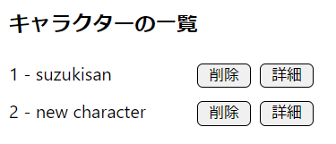

# キャラクターの追加方法（管理画面）

## STEP 1 - キャラクターDBに追加
1. 管理画面の [キャラー管理](http://localhost:3000/admin/characters)ページに移動しいてください。
2. キャラクター追加のインプットに新しいキャラクター名を入力し、`追加`を押してください。
3. `キャラクターの一覧`に追加されたキャラクター情報（id、名前、削除、詳細）が表示されます。  


## STEP 2 - 設定ファイルの読み込み
1. [キャラー管理](http://localhost:3000/admin/characters)ページの`キャラクターの一覧`からキャラクターの詳細ページに移動してください。
2. `設定ファイルのインポート`にあるファイルアップロードボタンをクリックし、キャラクターの設定ファイルを選択して、`送信`ボタンを押してください。設定ファイルの構成については　[設定ファイル構成について](#設定ファイル構成について)をご確認ください。

## STEP 3 - 動画変換
1. STEP 2の2が終了したら、キャラクターの動画を置くフォルダーが開かれます。そちらに、キャラクターの動画をcopy/pasteしてください。（直接管理画面からのアップロードに変えていく予定）
2. キャラクターの詳細画面（`詳細`ボタンを押してください。）から下の `変換開始` ボタンを押してください。
> ⚠ 動画ファイル数が多い時に変換処理に時間がかかりますので、終了まで、何も操作せずに、しばらくお待ちください。

## `⚠ 注意点`
キャラクター追加が終わったら、必ず [standby_video_id](how_to_setup_stanby_video_id.md)の設定を終えてからアプリを起動してください。
# キャラクターの削除方法
1. 管理画面の [キャラー管理](http://localhost:3000/admin/characters)ページに移動しいてください。
2. `キャラクターの一覧`の`削除`ボタンをクリックしてください。  


## キャラクターと一緒に削除される情報
> キャラクターを削除すると、キャラクターと連携している他の情報も一緒に削除されます。以下で詳細をご確認ください。  

キャラクターの
1. 動画ファイル（`C:\talk_with\app\public\videos`の`source`と`destination`の中のキャラクターフォルダー）
2. 動画データ（`videos`テーブル）
3. 設定データ（`character_settings`テーブル）
4. 対話成立データ（`conversations`テーブル）
5. スロットデータ（`slots`テーブル）
6. ログデータ（`play_logs, connection_logs, error_logs`テーブル）
7. まとめモードデータ（`summary`テーブル）
8. 聞き忘れモードデータ（`kikiwasure`テーブル）

# キャラクター設定の変更方法（未記入）
<!-- TODO -->


# キャラクターの追加方法（pgAdmin）
- 以下のコマンドをコピーし、`pgAdmin`でキャラクターを作成してください。`キャラクター名`の部分を追加したいキャラクター名に変更してください。
> pgadminの使い方については「[SQLコマンドで操作方法](./how_to_install_pg.md#SQLコマンドで操作方法)」に従ってください。
  ```sql
  INSERT INTO characters(name, owner_id) VALUES('キャラクター名', (SELECT id FROM users WHERE is_admin=true)) RETURNING ID;
  ```
- 実行したら、キャラクターのIDが以下のように返されます：


# 設定ファイル構成について
- 設定ファイルの名前は自由。
- `character_id`に設定は不要
- ソースコードのパスは自由（選択するようになっているため）
- ２行目に以下であること
  ```txt
  original_id, title, action, loop_count, original_next_id, mic_on, play_now, mic_on_millisecond, question, comment
  ```
- 項目数は上の10個のみ
- ファイルの拡張子は`.csv`で、文字のエンコーディングは`utf-8`であること
- フラグ系の項目（`mic_on, play_now, question`）などの値としては、`true`か`false`か`TRUE`か`FALSE`のいずれを入れてください。


## 動画設定について（自動で入れたい場合のみ）
以下のように動画名と設定ファイルを合わせれば、自動でデータベースにキャラクターのスタート動画、うなずき動画、無音時の動画、認識できないときの動画などが登録される。
> 管理画面からも設定できるようになっています。 [キャラクター設定の変更方法](#キャラクター設定の変更方法)をご覧ください。
1. スタート動画のタイトルは`start.mp4`であることていること
2. うなずき動画のタイトルは`listen.mp4`であることていること
3. 認識できない音の動画のタイトルは`unrecognized.mp4`であることていること
4. 無言時に再生する動画のタイトルは`silence.mp4`であることていること
5. 連続無言時に再生する動画のタイトルは`out.mp4`であることていること
6. SPJ判定スコアが低い時に再生する動画のタイトルは`spjlow.mp4`であることていること
