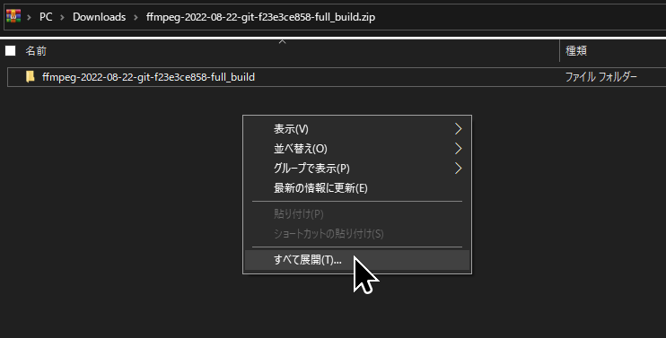
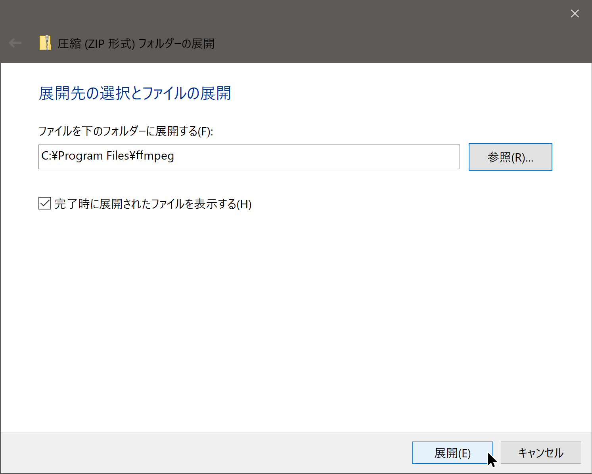
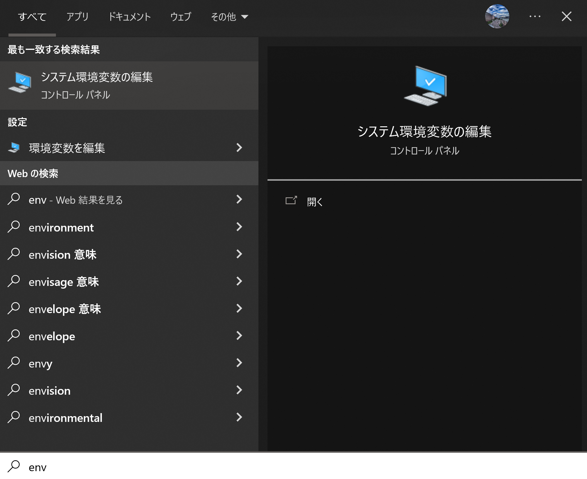
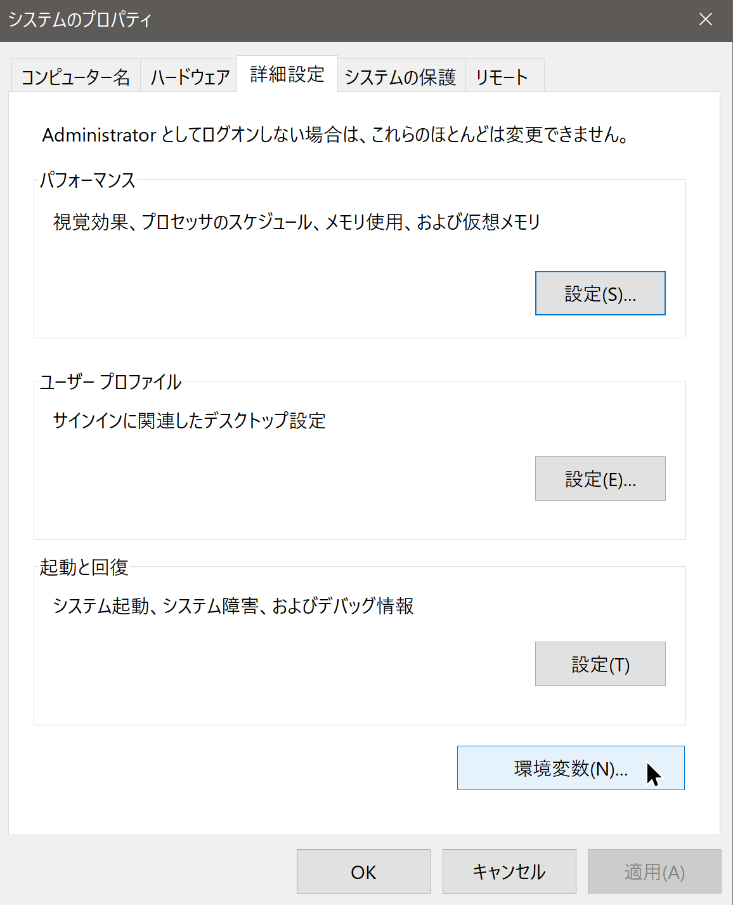
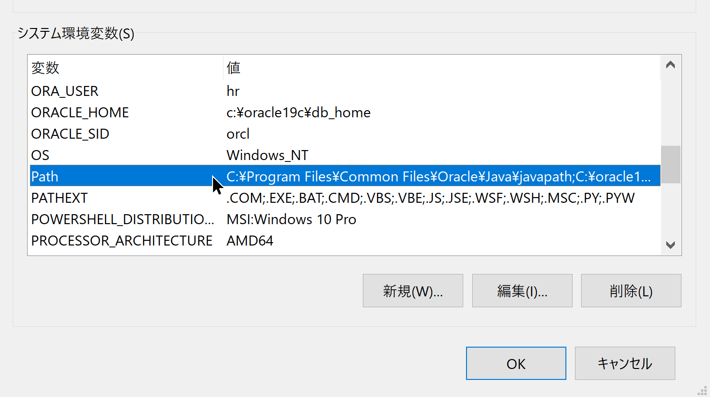
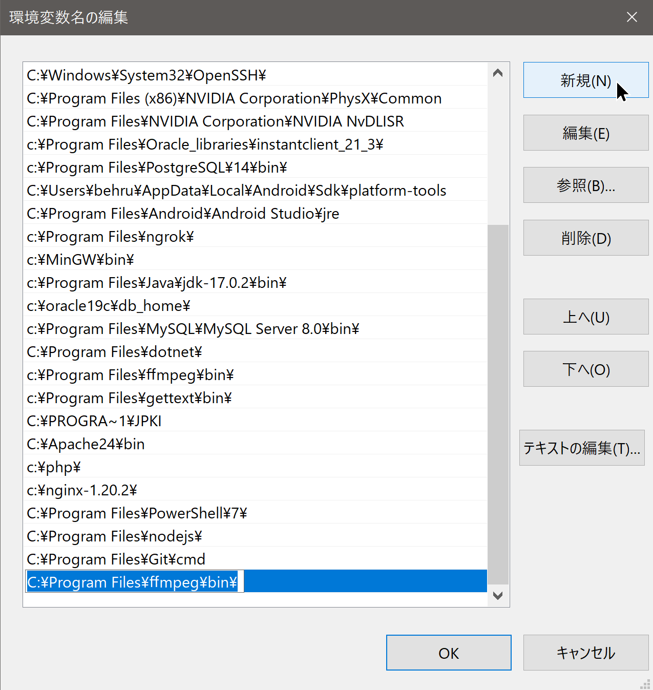

# Ffmpeg
FFmpeg は主要なマルチメディア フレームワークであり、人間と機械が作成したほぼすべてのものをデコード、エンコード、トランスコード、mux、demux、ストリーミング、フィルター処理、および再生できます。 最もあいまいな古代のフォーマットから最先端までサポートします。 それらが標準化委員会、コミュニティ、または企業によって設計されたかどうかは関係ありません。 移植性も高い: FFmpeg は、さまざまなビルド環境、マシン アーキテクチャ、および構成の下で、Linux、Mac OS X、Microsoft Windows、BSD、Solaris などでテスト インフラストラクチャ FATE をコンパイル、実行、および合格します。

# インストール方法
1. こちらの [ダウンロードリンク](https://github.com/GyanD/codexffmpeg/releases/download/2022-08-22-git-f23e3ce858/ffmpeg-2022-08-22-git-f23e3ce858-full_build.zip)をクリックし、インストーラーがダウンロードされます。
2. ダウンロードしたファイルを`C:\Program Files\ffmpeg`に展開する。`C:\Program Files`に`ffmpeg`というフォルダーを作成してください。
     
   
3. `C:\Program Files\ffmpeg\bin\`を環境変数`PATH`に追加してください。[環境変数PATHに追加](#環境変数PATHに追加)に従ってください。

# 環境変数PATHに追加
1. Windowsキーを押して`env`と検索してください。`システム環境変数の編集`をクリックしてください。  
   
2. `システムのプロパティ`画面から下の`環境変数`ボタンを押してください。  
   
3. `環境変数`画面から下の`システム環境変数`部分の一覧から`Path`という所をダブルクリックしボタンを押してください。  
   
4. `環境変数名の編集`画面から右の`新規`ボタンを押して、追加したい環境変数を入力し、`OK`ボタンで保存してください。  
   
5. 全て保存した後に、PCを再起動してください。