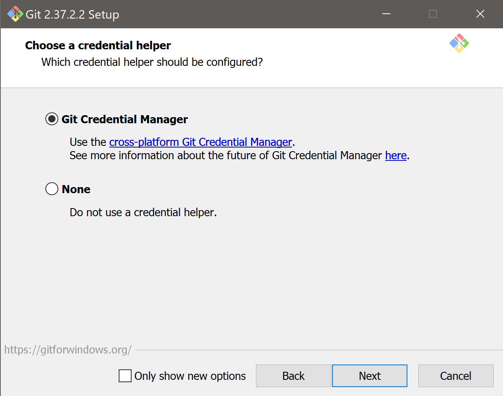

# Git
Git は、小規模なプロジェクトから非常に大規模なプロジェクトまで、すべてを迅速かつ効率的に処理できるように設計された、無料のオープン ソースの分散型バージョン管理システムです。

Git は習得が容易で、非常に高速なパフォーマンスを備えた小さなフットプリントを備えています。 Subversion、CVS、Perforce、ClearCase などの SCM ツールよりも優れており、安価なローカル ブランチ、便利なステージング エリア、複数のワークフローなどの機能を備えています。

# インストール方法
1. こちらの [ダウンロードリンク](https://github.com/git-for-windows/git/releases/download/v2.37.2.windows.2/Git-2.37.2.2-64-bit.exe)をクリックし、インストーラーがダウンロードされます。
2. ダウンロードが終わったら、ダウンロードファイルを実行してください。以下の画面が出ます。次はステップ14まで画像の通りかどうかをチェックし、`Next(次へ)`を押し続けてください。
     
3. ディレクトリはこのままで `Next(次へ)`を押し続けてください。  
   
4. Select Components画面も画像のままで、`Next(次へ)`を押してください。
   
5. `Next(次へ)`を押し続けてください。  
   
6. Choosing the default editor画面も画像のままで、`Next(次へ)`を押してください。こちらで `Visual Studio Code` を選択する必要がありません。デフォルトで選択されているものでそのまま次へ進んでください。
   
7. Adjusting the name 画面もそのままで、`Next(次へ)`を押してください。
   
8. Adjusting your path 画面も画像のままで、`Next(次へ)`を押してください。
   
9. Choosing the SSH executable 画面も画像のままで、`Next(次へ)`を押してください。
   
10. Choosing HTTPS transport backend 画面も画像のままで、`Next(次へ)`を押してください。
   
11. Configuring the line ending 画面も画像のままで、`Next(次へ)`を押してください。
   
12. Configuring the terminal 画面も画像のままで、`Next(次へ)`を押してください。
   
11. Choose the default behavior 画面も画像のままで、`Next(次へ)`を押してください。
   
12. Choose a credential helper 画面も画像のままで、`Next(次へ)`を押してください。
   
13. Configuring extra options 画面も画像のままで、`Next(次へ)`を押してください。
   
14. Configuring experimental options 画面も画像のままで、`Next(次へ)`を押してください。
   
15. Installing 画面も画像でインストールが終了するまで待ってください。
   
11. インストールが終了したら、インストール画面を閉じてください。

以上です。
