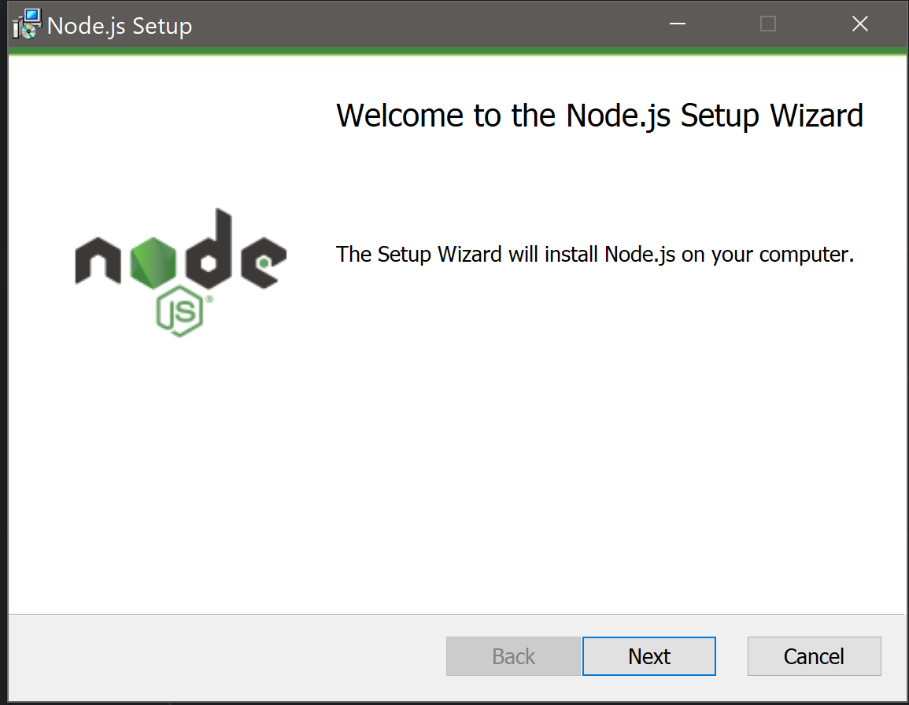
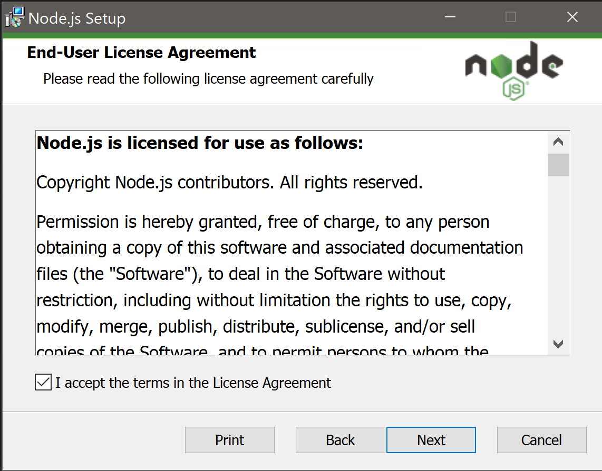
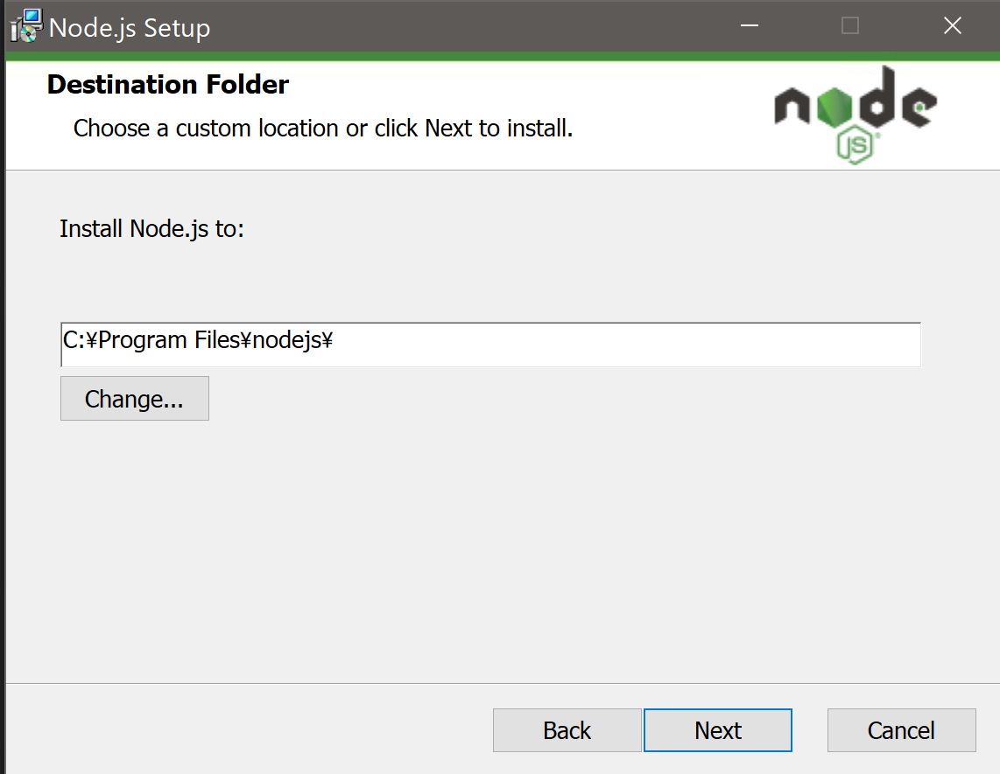
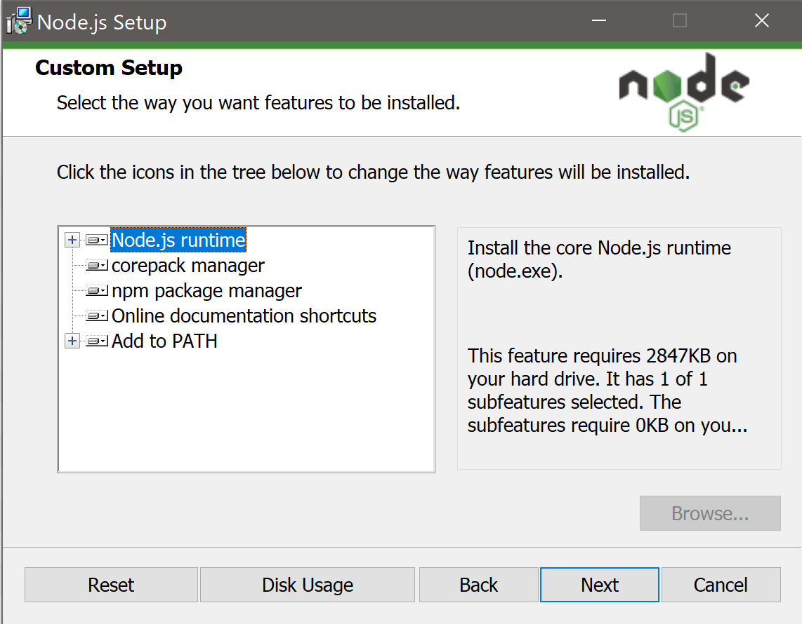
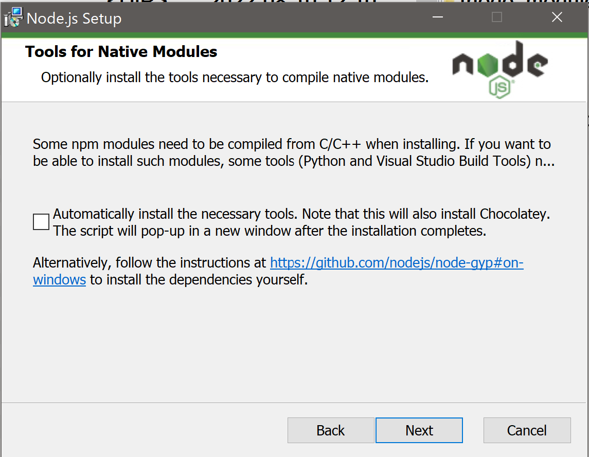
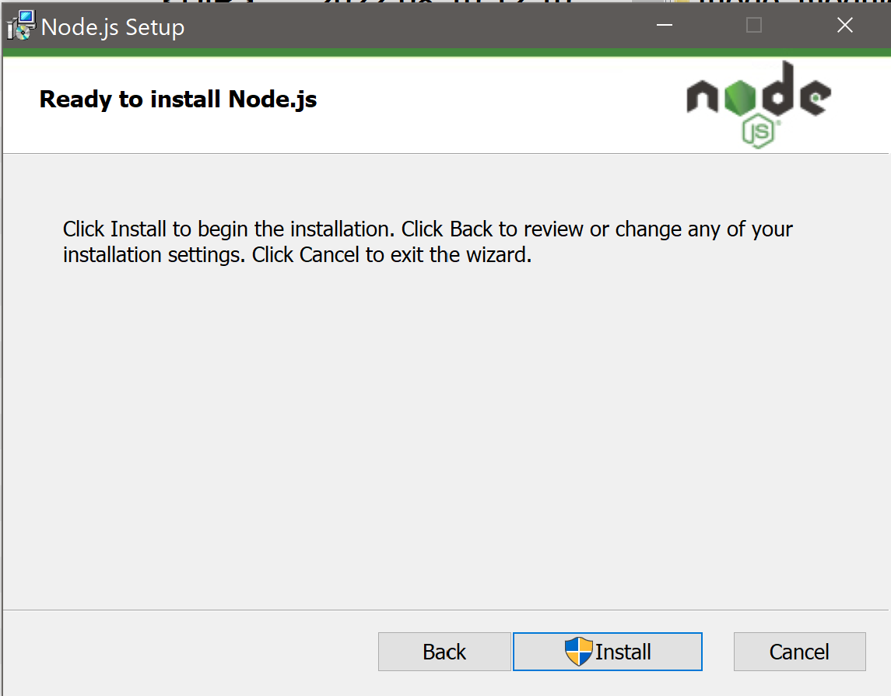

# NodeJS
Node.js はスケーラブルなネットワークアプリケーションを構築するために設計された非同期型のイベント駆動の JavaScript 環境です。

# インストール方法
1. こちらの [ダウンロードリンク](https://nodejs.org/dist/v16.17.0/node-v16.17.0-x64.msi)をクリックし、インストーラーがダウンロードされます。
2. ダウンロードが終わったら、ダウンロードファイルを実行してください。以下の画面が出ます。`Next(次へ)`を押してください。
     
3. プライバシーポリシーに同意のチェックをし、`Next(次へ)`を押してください。
   
4. インストールするフォルダーをそのままにし、`Next(次へ)`を押してください。
   
5. Custom Setup画面もそのままで、`Next(次へ)`を押してください。
   
6. Tools for Native Modules画面も画像のままに、`Next(次へ)`を押してください。
   
7. Ready to Install Node.js画面で、`Install(インストール)`を押してください。
   
8. インストールが終了したら、インストール画面を閉じてください。

以上です。
