# PostgreSQL
PostgreSQL は、強力なオープン ソースのオブジェクト リレーショナル データベース システムであり、30 年以上にわたって活発に開発されており、信頼性、機能の堅牢性、およびパフォーマンスで高い評価を得ています。

# インストール方法
1. こちらの [ダウンロードリンク](https://get.enterprisedb.com/postgresql/postgresql-14.5-1-windows-x64.exe)をクリックし、インストーラーがダウンロードされます。
2. ダウンロードが終わったら、ダウンロードファイルを実行してください。以下の画面が出ます。`Next(次へ)`を押し続けてください。  
   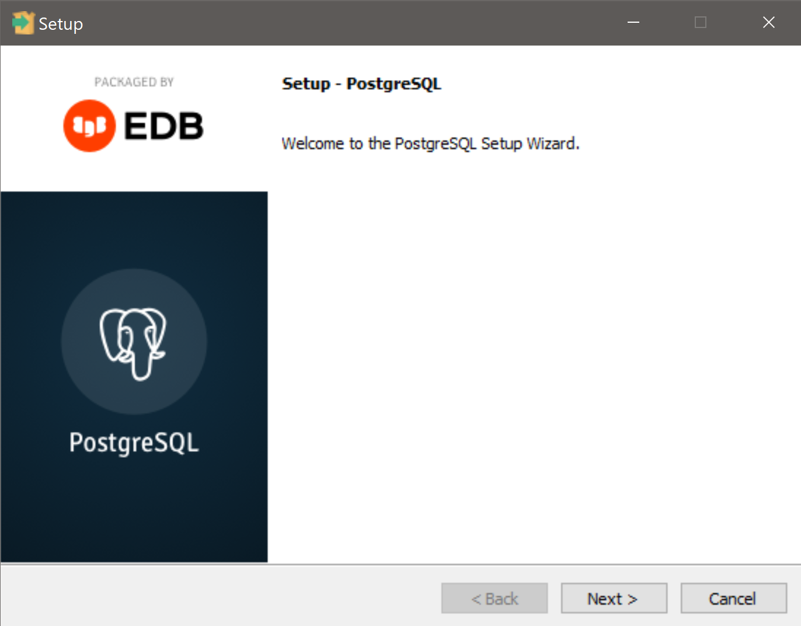  
3. Installation Directory 画面も画像のままで、`Next(次へ)`を押してください。  
   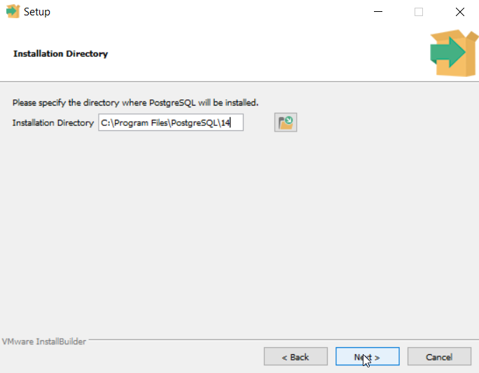
4. Select Components 画面も画像のままで、`Next(次へ)`を押してください。  
   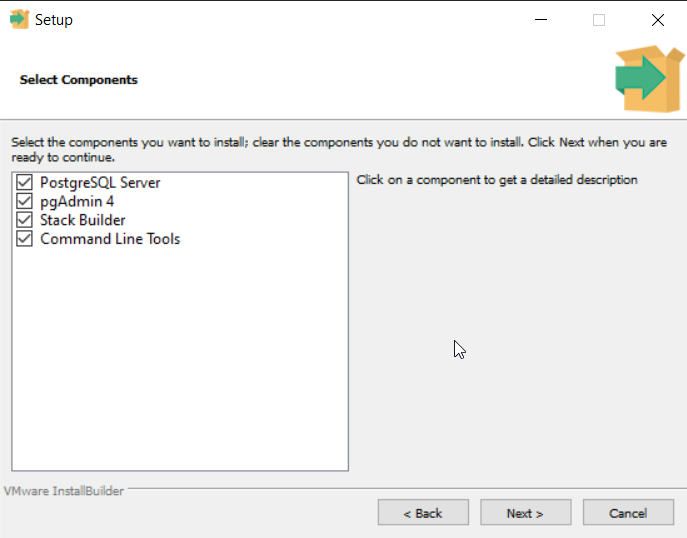
5. Data Directory 画面もそのままで、`Next(次へ)`を押してください。  
   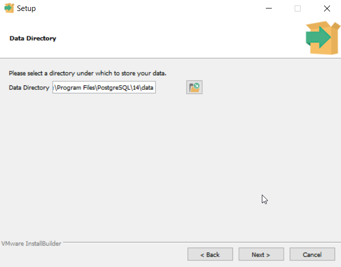
6. パスワード 画面でデーターベースの`マスターパスワード`を設定します。このパスワードを忘れると、データーベースを使えなくなりますので、入力するパスワードを大事にしてください。入力終わったら、`Next(次へ)`を押してください。  
   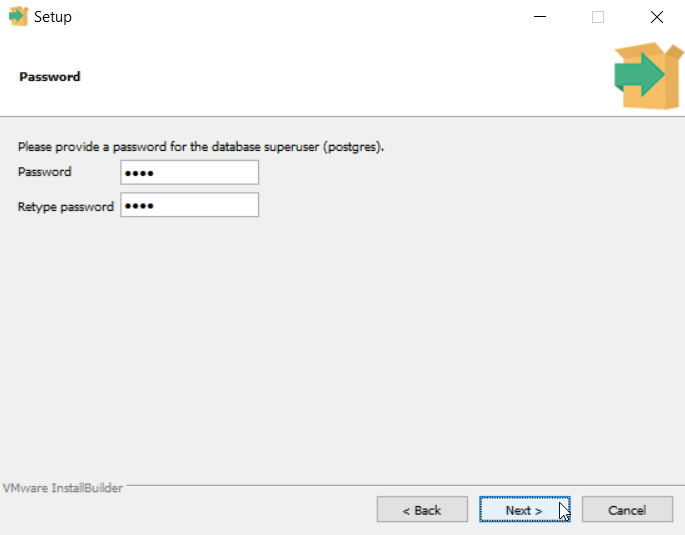
7. Port 画面も画像の`5432`のままで、`Next(次へ)`を押してください。  
   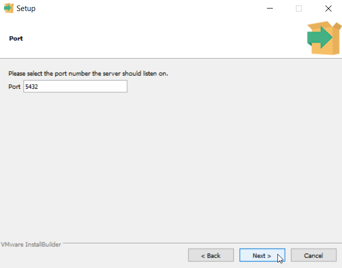
8. Advanced Options 画面も画像のままで、`Next(次へ)`を押してください。  
   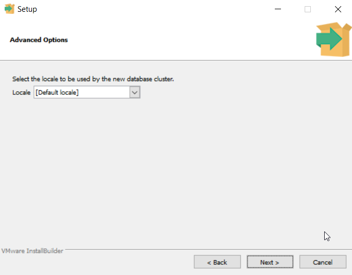
9. Pre-Installation Summary 画面も画像のままで、`Next(次へ)`を押してください。  
   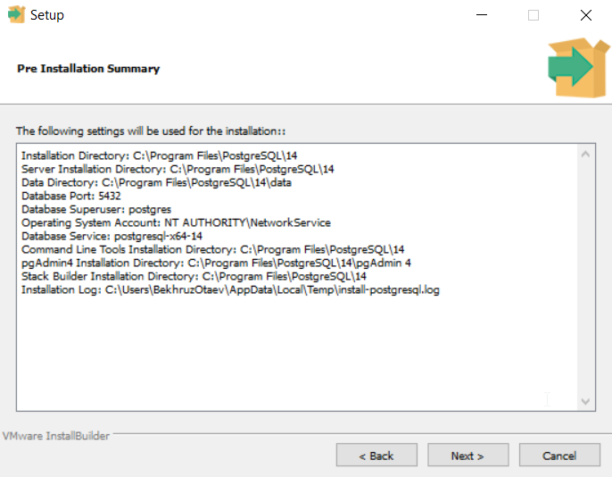
10. Ready to Install 画面も画像のままで、`Next(次へ)`を押してください。  
   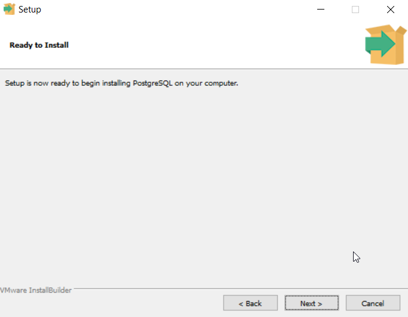
11. Installing 画面でインストール処理が終わるまでお待ちください。  
   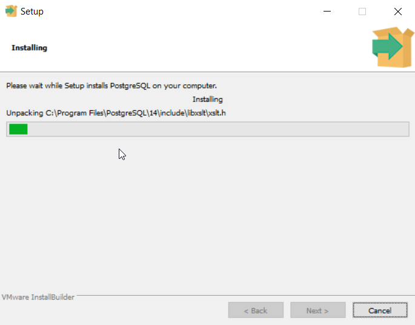
12. Completing the PostgreSQL Setup 画面で`Stack Builder`を実行するチェックを外してください。`Finish(完了)`を押してください。  
   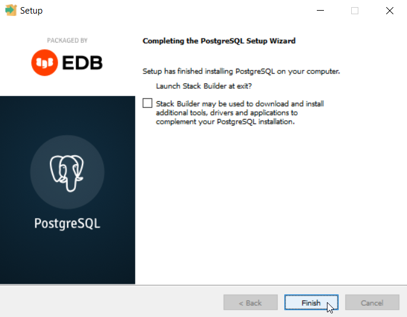

# pgAdminの使い方
pgAdmin は、世界で最も先進的なオープン ソース データベースである Postgres の主要なオープン ソース管理ツールです。 pgAdmin 4 は、初心者と経験豊富な Postgres ユーザーの両方のニーズを満たすように設計されており、データベース オブジェクトの作成、保守、および使用を簡素化する強力なグラフィカル インターフェイスを提供します。   
## pgAdminアプリの開き方
1. Windowsキーを押して`pgadmin`と検索してください。以下の様な結果が出ます    
   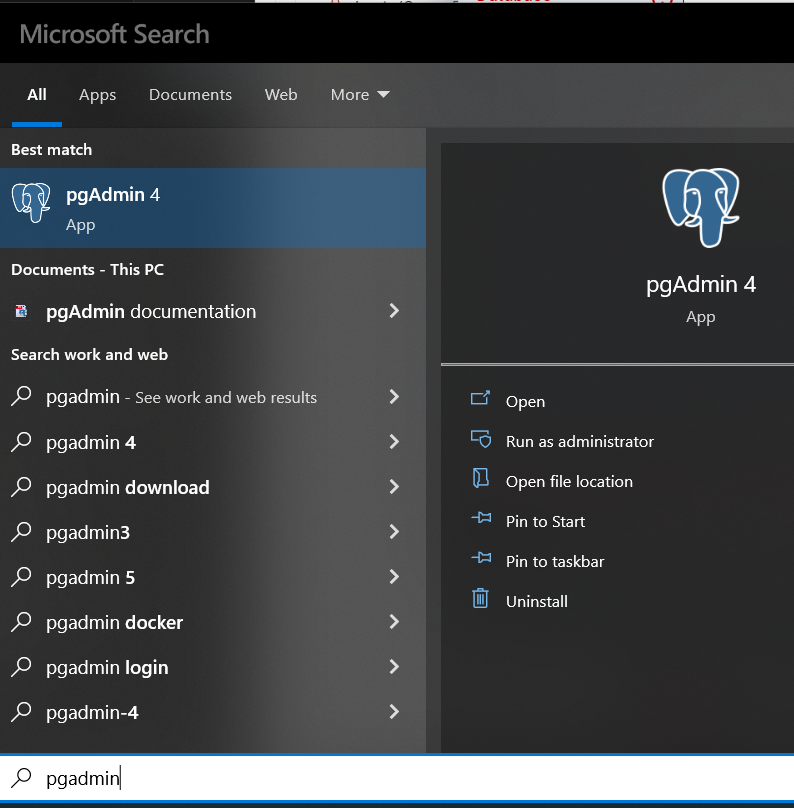
2. pgAdminのアイコンをクリックしてください。
3. `PostgreSQL`をインストールした際に設定した`マスターパスワード`入力ボックスが出ます。入力を行い、`OK`を押して下さい。[PostgreSQLのインストール方法](#インストール方法)のステップ6をご参照ください。

## データーベースの作り方
1. pgAdminを開いてください。参照は [pgAdminアプリの開き方](#pgAdminアプリの開き方)にしてください。
2. 左👈側の`Browser`欄から、`PostgreSQL 14` -> `Databases` を選んで、右クリックしてください。右クリックメニューの`Create` -> `Database...`をクリックしてください。    
   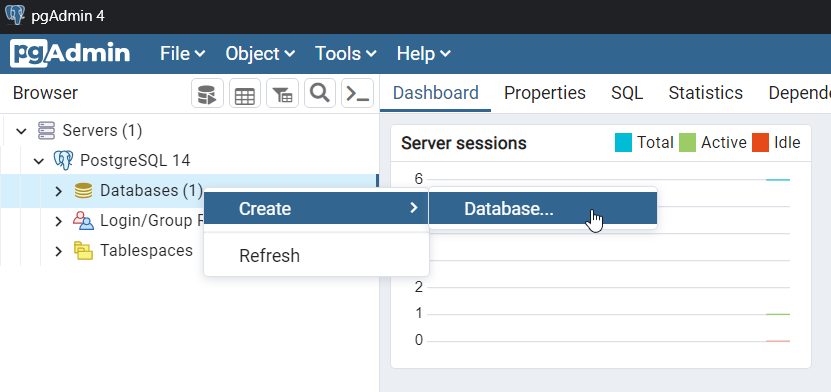
3. `Create - Database`というポップアップが出ます。`Database`という入力ボックスに`talk_with`って入力し、`Save`ボタンを押してください。
4. ポップアップがなくなって、左側の`Databases`の中に`talk_with`とうデーターベースができます。    
   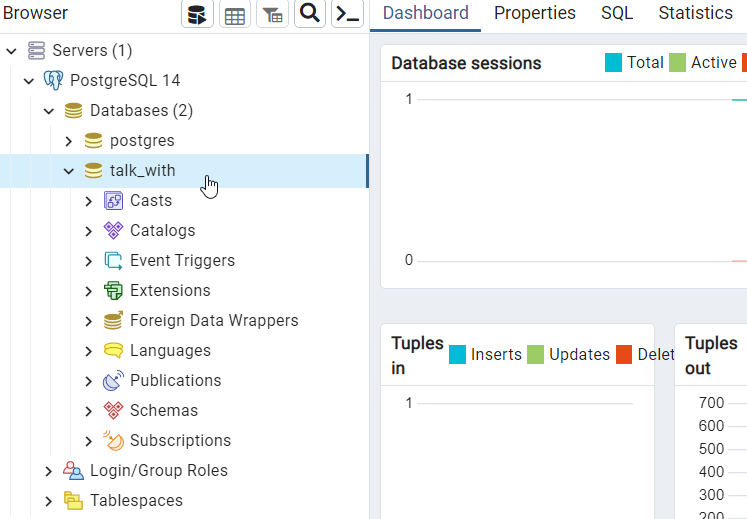

## 情報の表示
1. pgAdminを開いてください。参照は [pgAdminアプリの開き方](#pgAdminアプリの開き方)にしてください。
2. 左👈側の`Browser`欄から、`PostgreSQL 14` -> `Databases` -> `talk_with` -> `Schemas` -> `public` -> `tables` の中から見たいテーブルを右クリックして、`View/Edit Data` -> `All Rows`をクリックしてください。  
   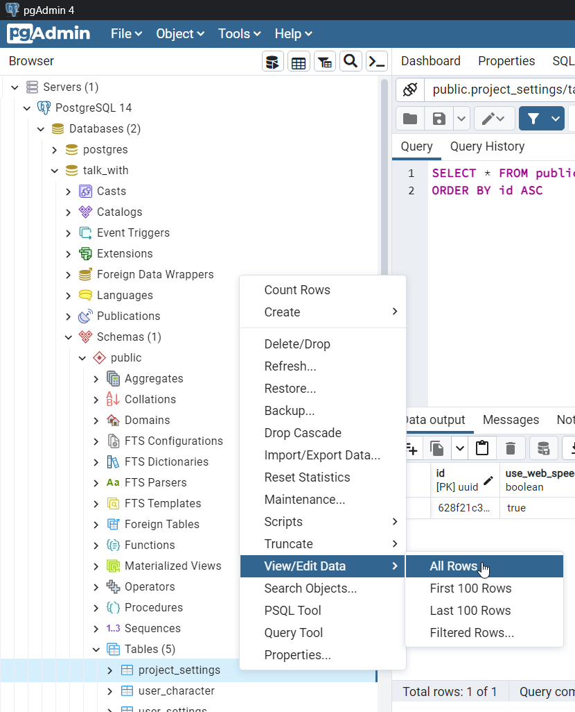
3. 画面中央にテーブル全情報一覧が表示されます    
   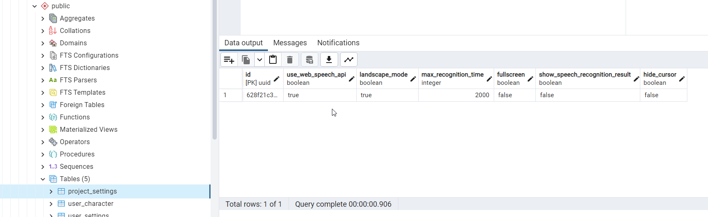

## 情報の更新
1. 変更したい情報を表示してください。[情報の表示](#情報の表示)を参照してください。
2. テーブルから、変更したい行のデーターにダブルクリックしてください。クリックしたデーターの式によって編集方法が少し変わります。
   * `bool(true/false)`式の場合
     * チェックボックスがチェックされているなら => `true`
     * チェックボックスが空白なら => `false`
     * チェックボックスが？マークがついていたら => `null`  
      の意味になります。  
      
   * `uuid`、`character`、`text`式のいずれの場合
     * 入力のポップアップが出ます。そこで変更を行って`OK`ボタンを押してください。  
      
   * `integer`、`float`の場合
     * 数値を直接入力できます。  
      
3. 変更内容を保存するには上のデーターベース保存アイコンをクリックしてください。  
   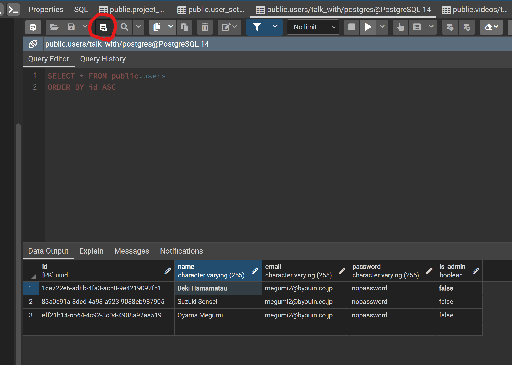
   > 注意点： このアイコンを押さないと、変更内容はDBに保存されないです。　　

## 情報の削除
1. 変更したい情報を表示してください。[情報の表示](#情報の表示)を参照してください。
2. テーブルから、削除したい列の順番番号（一番左にある）をクリックしたら、ハイライトされます。ハイライトは選択中の列の意味になります。他の列の順番番号もクリックするとハイライトされます。
   * ハイライトされた列をキャンセルしたい場合は、順番番号を再度クリックしてください。  
   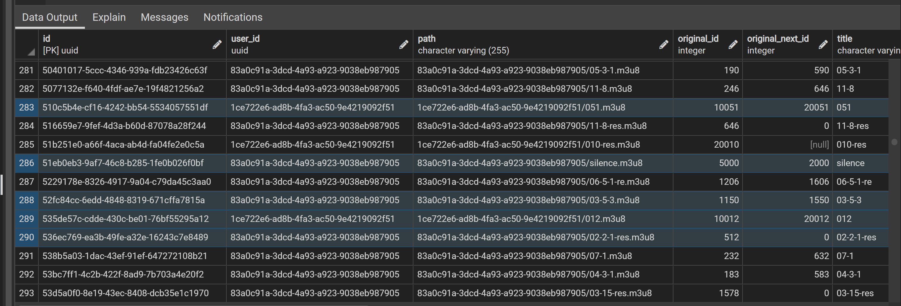
3. 削除したい列がハイライト中のまま、上のごも箱アイコンをクリックすると、ハイライト列に赤色の取り消し線ができます。
   * 取り消し線をキャンセルする場合は、再度ゴミ箱アイコンをクリックしてください。  
   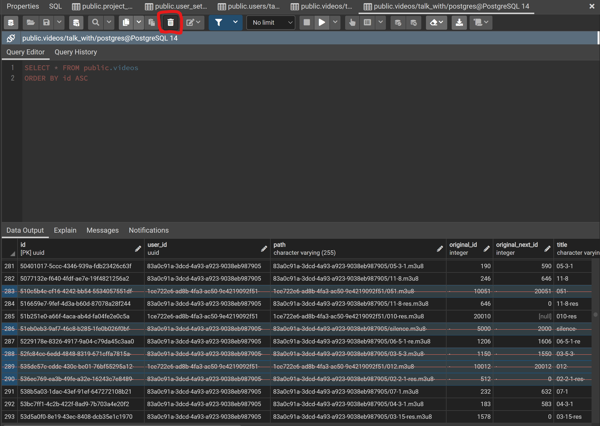
4. 削除をデーターベースで反映させるため、データーベース保存アイコンをクリックしてください。  
   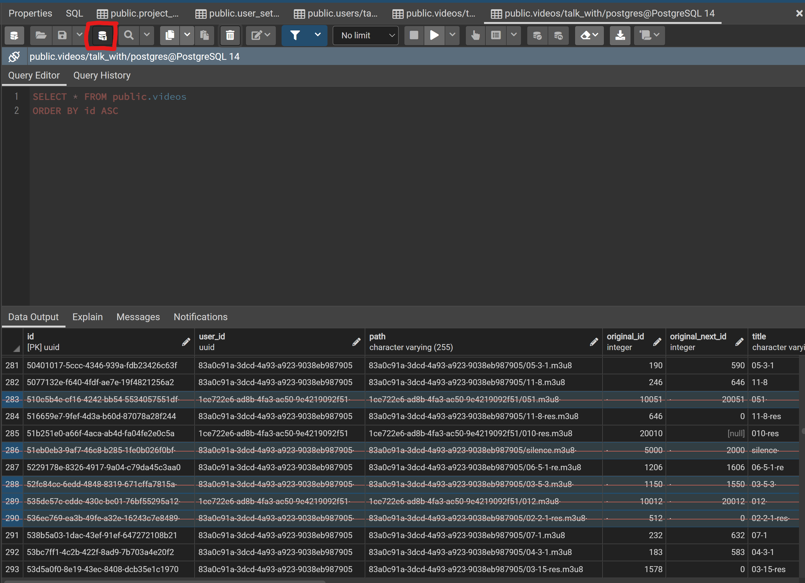
   > 注意点： このアイコンを押さないと、選択列はDBから削除されないです。