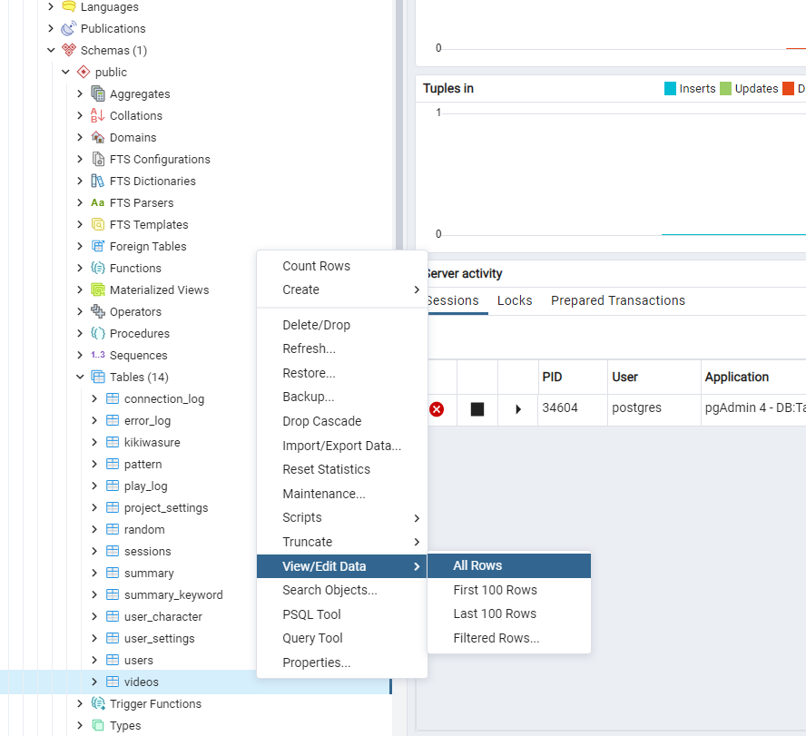
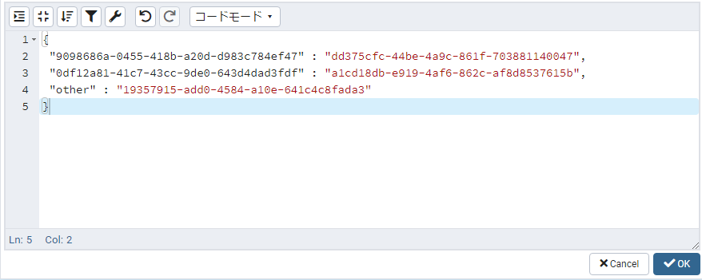

# alternative_list（動画ID → 変換ID）
`alternative_list（動画ID → 変換ID）`とは、SPJから来た動画IDが現在再生している動画のalternative_listにあったら、該当動画の代わりに他の動画を再生させる機能です。

# 例
* 現在再生している動画のalternative_list
  ```javascript
  {
    "動画A"　：　"動画B",
    "動画C"　：　"動画D",
    "other"　：　"動画E",
  }
  ```
ex1) SPJから動画Aが来た場合　→　動画Aの代わりに動画Bを再生させる   

ex2) SPJから動画Cが来た場合　→　動画Aの代わりに動画Dを再生させる   

ex3) SPJから動画Aと動画B以外の動画が来た場合　→　動画Aと動画B以外の動画の代わりに動画Eを再生させる

# 設定方法
1. pgAdmin4のアプリケーションを立ち上げます。
2. pgadminブラウザでtalk-withにあるvideosテーブルを探して右クリックしてView/Edit DataのAllRowsをクリックします。   
( Servers - PostgreSQL - Databases - Talk-With - Schemas - public - Tables - videos )
  
3. 指定したい動画のalternative_listの項目に下記のような型式でデータを記入します。記入がし終わったらOKボタンをクリックしてください。（記入したい欄をダブルクリックすると編集ができます。    
    ```javascript
    {
            (key)                     (value)
      "SPJから来る動画ID"　：　"再生させたい動画ID",
      "SPJから来る動画ID"　：　"再生させたい動画ID",
      "SPJから来る動画ID"　：　"再生させたい動画ID",
      ・・・,
      "other"　：　"再生させたい動画ID", // 最後の(key)はotherで書いてください。
    }
    ``` 
    
4. F6ボタン又は画面上にあるボタン（下のイメージを参考）をクリックしたら保存できます。
  .png)
5. これで事前準備は完了しましたのでtalk-withアプリを立ち上げて確認します。