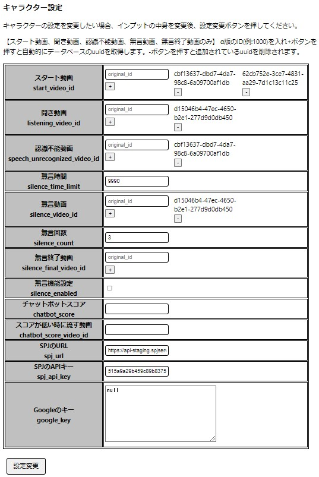

# character_settingsテーブルの更新方法
`character_settingsテーブルの更新方法`とは、管理画面で追加されたキャラクターの詳細設定をすることです。（キャラクター名の右側にある詳細ボタンをクリックしてください。）

# 設定方法
## キャラクター情報（名前の変更）  
  * キャラクターの名前を変更する場合はキャラクター情報の支持を従ってください。
  

## キャラクター設定  
  * 項目の機能は[データベース構成](./DB.md)を参考にしてください。
  * `[必須] spj_url, spj_api_key, google_keyは記入`してください。
  * 項目別の記入が終わったら、表の下にある"設定変更"保存されます。  
  

# 追加内容
## 設定ファイルのインポート 
  * キャラクターを追加する際にvideoSetting.csvファイルをインポートするところです。  
  

## キャラクターの動画変換
  * キャラクターを追加する際、videoSetting.csvを送信した後、自動で開かれるディレクトリに動画を入れて"変換開始"ボタンを押しますとmp4の動画がm3u8の動画で変換させます。
  * ディレクトリ：talk-with/app/public/video/source  
    
