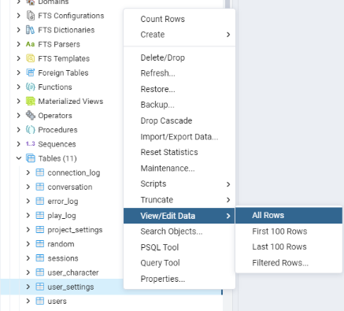
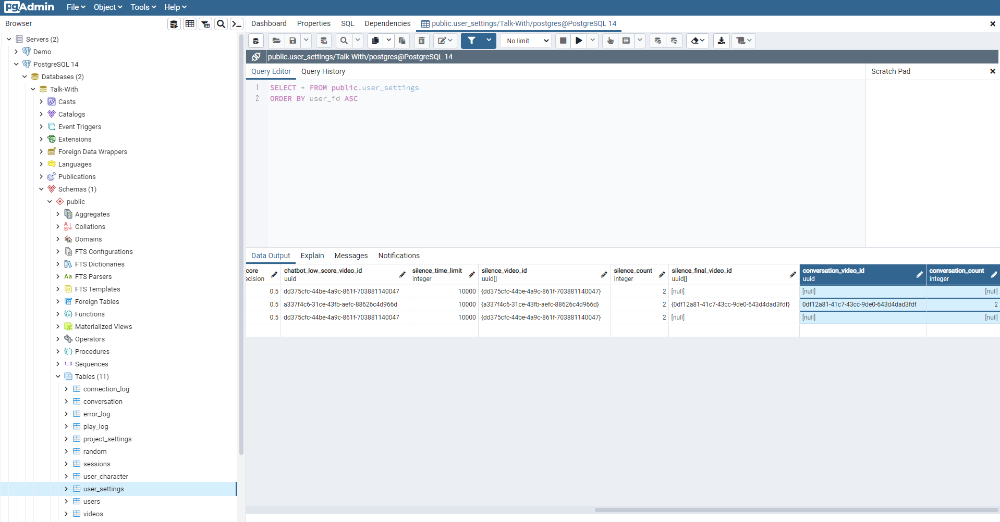
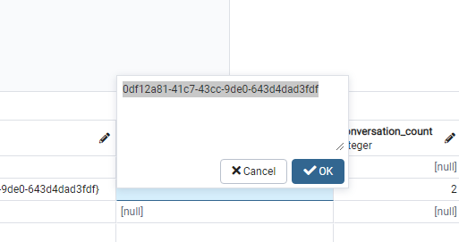
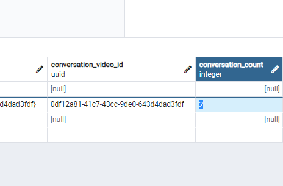

# ベター10: 対話成立のカウンターとは
`ベター10: 対話成立のカウンター`とは、ユーザーとキャラクター間の対話が成立した回数をカウンターし、成立した対話の回数があらかじめ設定した対話の回数と同じになると、登録したビデオが再生される機能です。    
* 対話の成立条件（マイクがonの時だけ）    
１回分　：　ユーザーが言う → ユーザーが言った言葉をspjへ送る → spjから正しい返事の映像が来て再生
<!-- 簡単な説明 -->
<!-- １回分　：　ユーザーが言う → キャラクターが話す（正しい映像の場合） -->

# 使い方

1. pgAdmin4のアプリケーションを立ち上げます。
2. pgadminブラウザでtalk-withにあるproject_settingsテーブルを探します。   
   ( Servers - PostgreSQL - Databases - Talk-With - Schemas - public - Tables - user_settings )
3. user_settingsを右クリックしてView/Edit DataのAllRowsをクリックします。
   
4. user_settingsのテーブルが読み込まれたら,conversation_video_idとconversation_countの項目を探します。
   
5. `conversation_video_id`, `conversation_count`の項目に下記のような型式でデータを記入します。記入がし終わったらOKボタンをクリック又はエンターを押してください。（記入したい欄をダブルクリックすると変更ができます）   
   
   
6. F6ボタン又は画面上にあるボタン（下のイメージを参考）をクリックしたら保存できます。
  .png)    

7. talk-withのアプリケーションを立ち上げて確認してください。

# 流れ
1. データベースの設定（conversation_video_id, conversation_count)
  * ex)　conversation_video_id = "A"   
  * ex)　conversation_count = 2
2. talk-withのアプリケーションの立ち上げ
3. キャラクターの選択（対話スタート）
4. ユーザーが言う（言葉：お腹が痛いです。）
5. キャンピングが話す（言葉：何時から痛かったんですか。）-　対話１回目
6. ユーザーが言う（言葉：昨日からです。）
7. キャンピングが話す（言葉：そうですか。）-　対話２回目
8. 対話を2回カウンターしたので、conversation_video_idである映像Aを再生し終わったら終了
