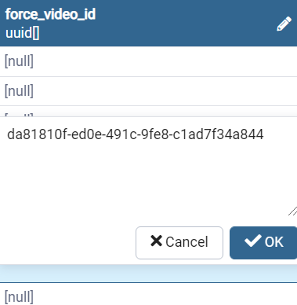

# 強制再生とは
`強制再生`とは、ユーザーが何を言っても事前に指定した動画を強制的に再生させる機能です。

# 設定方法
1. pgAdmin4のアプリケーションを立ち上げます。
2. pgadminブラウザでtalk-withにあるvideosテーブルを探して右クリックしてView/Edit DataのAllRowsをクリックします。    
  ( Servers - PostgreSQL - Databases - Talk-With - Schemas - public - Tables - videos )
  
3. `force_video_id`の項目に下記のような型式でデータを記入します。記入がし終わったらOKボタンを押してください。（記入したい欄をダブルクリックすると編集ができます）   
      
4. F6ボタン又は画面上にあるボタン（下のイメージを参考）をクリックしたら保存できます。
  .png)    
5. これで事前準備は完了しましたのでtalk-withアプリを立ち上げて確認します。