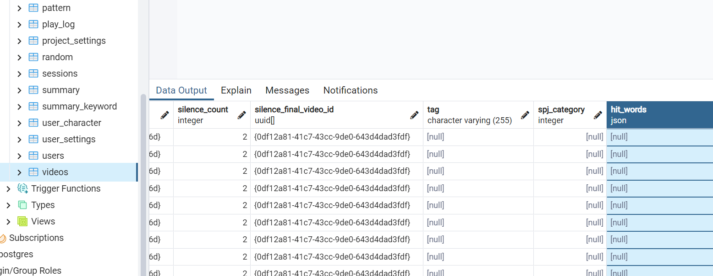
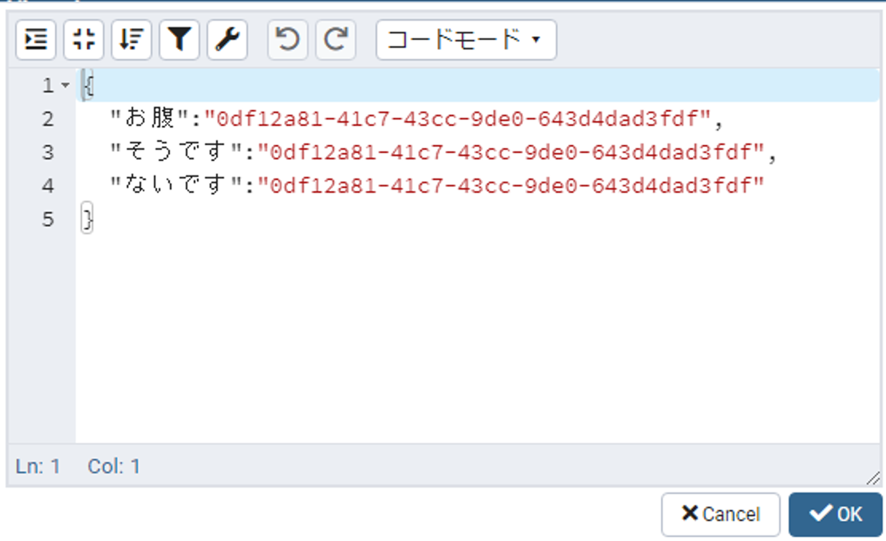

# hit_wordsとは

`hit_words`とはユーザーが言った言葉に特定単語及び文章がある場合、事前に指定した動画を再生する機能です。例えば、特定単語「"痛い"、"発熱"、"頭痛"」と特定単語があった場合、単語ごとに流す動画（動画A、動画B、動画C）を事前に指定します。ユーザーが「昨日から頭が痛いです。」と言ったら、文書の中に「痛い」という特定単語が入っているので動画Aを再生します。

# 使い方
1. pgAdmin4のアプリケーションを立ち上げます。
2. pgadminブラウザでtalk-withにあるvideosテーブルを探して右クリックしてView/Edit DataのAllRowsをクリックします。   
( Servers - PostgreSQL - Databases - Talk-With - Schemas - public - Tables - videos )
  
3. hit_wordsの項目に下記のような型式でデータを記入します。記入がし終わったらOKボタンをクリックしてください。（記入したい欄をダブルクリックすると変更ができます）  
  
  
   ```javascript 
   { 
      "特定単語":"動画ID",
      "特定単語":"動画ID",
      "特定単語":"動画ID",
      ...
   }
   ```
4. F6ボタン又は画面上にあるボタン（下のイメージを参考）をクリックしたら保存できます。
  .png)
5. これで事前準備は完了しましたのでtalk-withアプリを立ち上げて確認します。