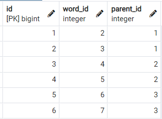

# hit_wordsとは

`hit_words`とはユーザーが言った言葉に特定単語及び文章がある場合、事前に指定した動画を再生する機能です。

例えば、特定単語「"痛い"、"発熱"、"頭痛"」と特定単語があった場合、単語ごとに流す動画（動画A、動画B、動画C）を事前に指定します。ユーザーが「昨日から頭が痛いです。」と言ったら、文書の中に「痛い」という特定単語が入っているので動画Aを再生します。

加えて下のイメージのように単語ごとに複数の子供単語を持ちことができます。  
    
# データベース
[`block_words`] : spjに送る前にチェックする単語のテーブル
| カラム      | 説明                                
|----------|------------
| id       | 主キー                                 
| block_id | ブロックID。                              
| word     | 単語                                 
| video_id | wordが一致したら飛ぶブロックのtrigger_video_id 

[`block_word_parent_relationships`] : block_wordsの単語の関係性を設定するテーブル
| カラム       | 説明                      
|-----------|--------------------------
| id        | 主キー                      
| word_id   | 単語ID。block_wordsのid     
| parent_id | 単語の親のID。block_wordsのid 
# 注意点
* ヒットワードが当たった時は一番下の言葉の動画を再生されます。
# 使い方

## 管理画面での使い方
1. Talk-Withのアプリを立ち上げて[ブロックの追加・変更・削除]ページに入る。
     
2. 下のイメージのように単語の設定及びその単語に子供の単語を設定するためには`単語の登録（Hit Word List欄）`と`単語の関係登録（Parent Relationship List欄）`が必ず必須です。
  単語を追加するときは、wordとvideo_idの欄にデータを入力して追加ボタンを押してください。(wordは必ず記入してください。)
* 削除  
  単語の一番右側にあるXボタンを押すと削除されます。
* 更新  
  更新したい単語を押すと、word_idとparent_idの欄に自動で表示せれます。変更したいところを変更して変更ボタンを押してください。（wordは必ず記入してください。）  
     
4. `単語の登録`が終わったら、`単語の関係登録`も設定してください。`単語の関係登録`は追加・削除の機能があります。（word_idは`単語の関係登録`に一度だけ登録されます。）
* 登録  
  word_idとparent_idには`単語の登録`欄で登録した単語の番号(id)を記入してください。一番上の言葉はだったら、`単語の関係登録`をしないでください。（word_idとparent_idは必ず記入してください。）
     
   例）下のイメージのように作る場合は、下記のテーブルように作成してください。  
   word_id | parent_id |単語
   -|-|-
  2|1|お腹-痒い

     
* 削除  
  単語関係の一番右側にあるXボタンを押すと削除されます。

## pgAdminでの使い方
### [ `block_wordsのテーブル` ]
1. pgAdmin4のアプリケーションを立ち上げます。
2. pgadminブラウザでtalk-withにあるblock_wordsテーブルを探して右クリックしてView/Edit DataのAllRowsをクリックします。   
( Servers - PostgreSQL - Databases - Talk-With - Schemas - public - Tables - block_words )
    
  * id : 記入しないでください。
  * block_id：ブロックIDを記入してください。
  * word：ヒットワードを記入してください。
  * video_id：動画IDを記入してください。  
3. 記入が終わったら、F6ボタン又は画面上にあるボタン（下のイメージを参考）をクリックしたら保存できます。
  .png)
4. これで事前準備は完了しましたのでtalk-withアプリを立ち上げて確認します。
### [ `block_word_parent_relationshipsのテーブル` ]  
1. pgAdmin4のアプリケーションを立ち上げます。
2. pgadminブラウザでtalk-withにあるblock_word_parent_relationshipsテーブルを探して右クリックしてView/Edit DataのAllRowsをクリックします。   
( Servers - PostgreSQL - Databases - Talk-With - Schemas - public - Tables - block_word_parent_relationships )  
    
  * id : 記入しないでください。
  * word_id : block_wordsテーブルに登録されたidを記入してください。（block_wordsテーブルのid）
  * parent_id : block_wordsテーブルに登録されたidを記入してください。（block_wordsテーブルのid）

3. 記入が終わったら、F6ボタン又は画面上にあるボタン（下のイメージを参考）をクリックしたら保存できます。
  .png)
4. これで事前準備は完了しましたのでtalk-withアプリを立ち上げて確認します。

