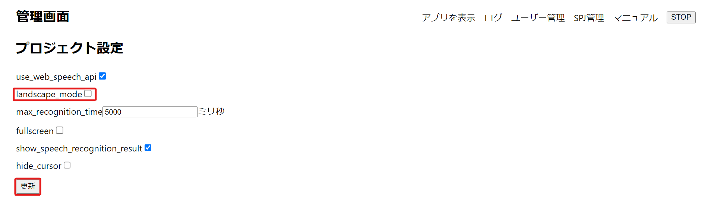
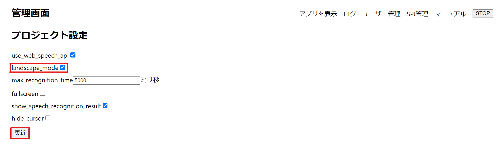
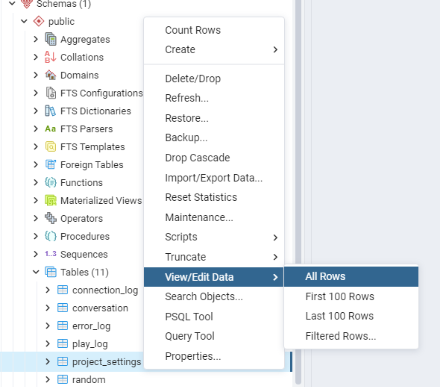
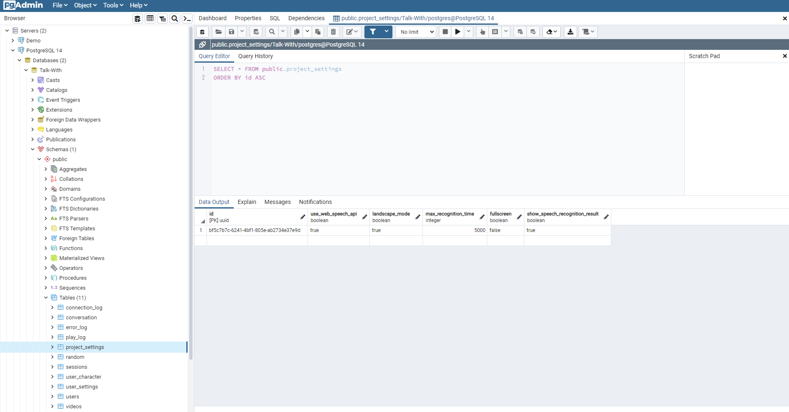

# Landscape_modeとは
`landscape_mode`とはキャラクターを選択する画面及びマイクを横モードまたは縦モードに設定する機能です。   
データベースのproject_settingsにあるlandscape_mode項目の設定によりコントロールが可能です。

方向 | landscape_mode
---------------|---------- 
横モード | true   
縦モード | false

# 設定方法 (二つの方法：管理画面及びpgAdmin4アプリ)

### [ 管理画面での設定 ]
1. talk-withのアプリケーションを立ち上げます。
2. ブラウザでlocalhost:3000/adminにアクセスします。
3. talk-withアプリの画面を縦にしたいとlandscape_modeをチェックせずに更新ボタンを押してください。
   
4. [ landscape_mode : 縦モード ]
.png)
.png)
5. talk-withアプリの画面を横にしたいとlandscape_modeをチェックして更新ボタンを押してください。
   
6. [ landscape_mode : 横モード ]
.png)
.png)

### [ pgAdmin4アプリでの設定 ]

1. pgAdmin4のアプリケーションを立ち上げます。
2. pgadminブラウザでtalk-withにあるproject_settingsテーブルを探します。   
   ( Servers - PostgreSQL - Databases - Talk-With - Schemas - public - Tables - project_settings )
3. project_settingsを右クリックしてView/Edit DataのAllRowsをクリックします。
   
4. 下の画面が見えます。
   
5. landscape_modeの項目の下にあるtrueが書いている欄をダブルクリックすると編集が可能になります。
   .png)
   * trueの場合  
   .png)
   * falseの場合  
   .png)
6. 変更したら、エンターを押して赤いボックスでチェックされたところを押すか、F6ボタンを押してください。
   .png)
7. これでデータベースのlandscape_nodeの設定は完了です。
8. talk-withのアプリケーションを立ち上げて確認してください。
> lnadscape_modeがtrueの場合　　　　
.png)
.png)

> lnadscape_modeがfasleの場合
.png)
.png)
