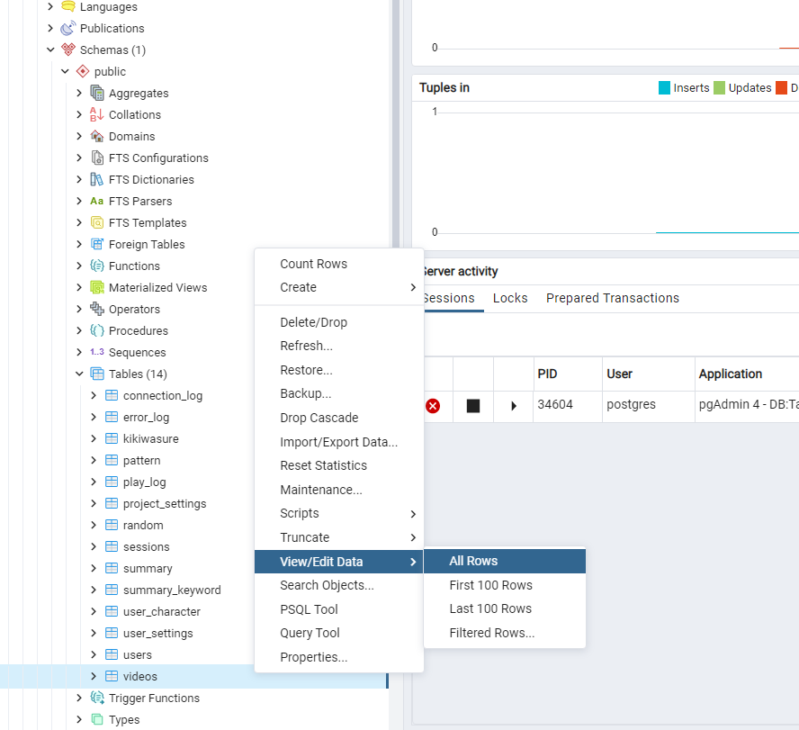

# max_recognition_timeとは

`max_recognition_time`とは、マイクがONになったとき音声認識する時間を測って事前に設定した時間になったら認識した音声を強制的にSPJへ送る機能です。

# 設定方法 (プロジェクト全体の設定及び動画別の設定)

### [ プロジェクト全体の設定 ]
1. talk-withのアプリケーションを立ち上げてブラウザでlocalhost:3000/adminにアクセスします。
2. 管理画面のプロジェクト設定のmax_recognition_timeに設定したい数字を記入して変更ボタンを押してください。(　単位　：　１秒 = 1000　)

### [ 動画別の設定 ]
1. pgAdmin4のアプリケーションを立ち上げます。 
2. pgadminブラウザでtalk-withにあるvideosテーブルを探して右クリックしてView/Edit DataのAllRowsをクリックします。    
( Servers - PostgreSQL - Databases - Talk-With - Schemas - public - Tables - videos )  
  
3. `max_recognition_time`の項目に設定したい数字を記入します。記入がし終わったらエンター押してください。（記入したい欄をダブルクリックすると編集ができます）　　　　
      
4. F6ボタン又は画面上にあるボタン（下のイメージを参考）をクリックしたら保存できます。
  .png)    
5. これで事前準備は完了しましたのでtalk-withアプリを立ち上げて確認します。
