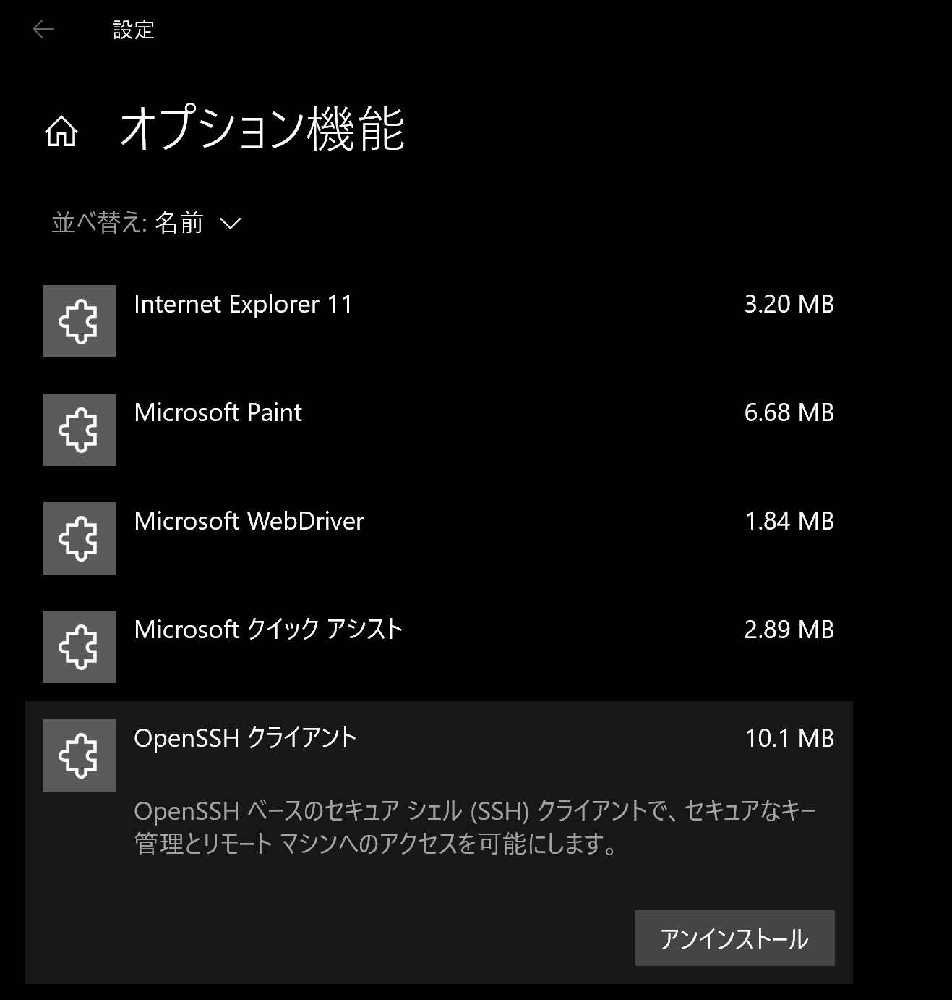
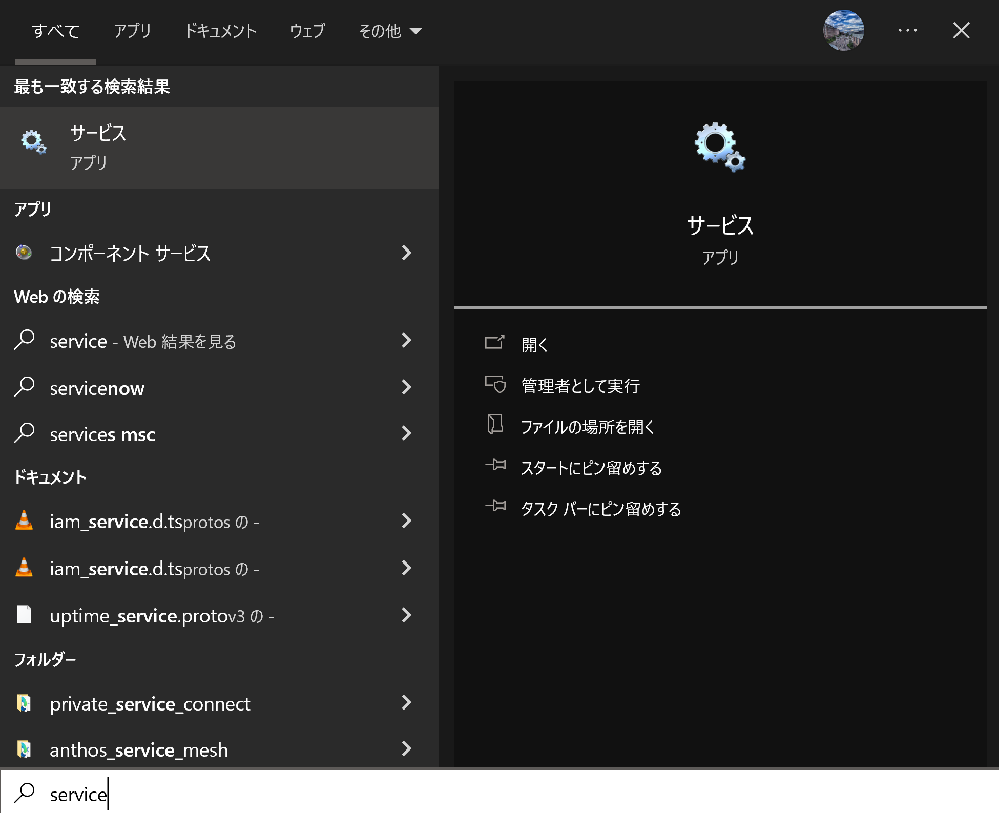
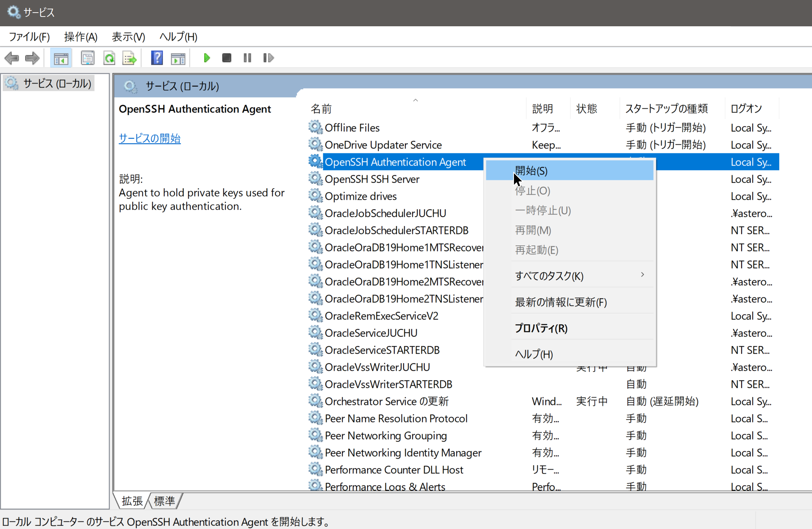
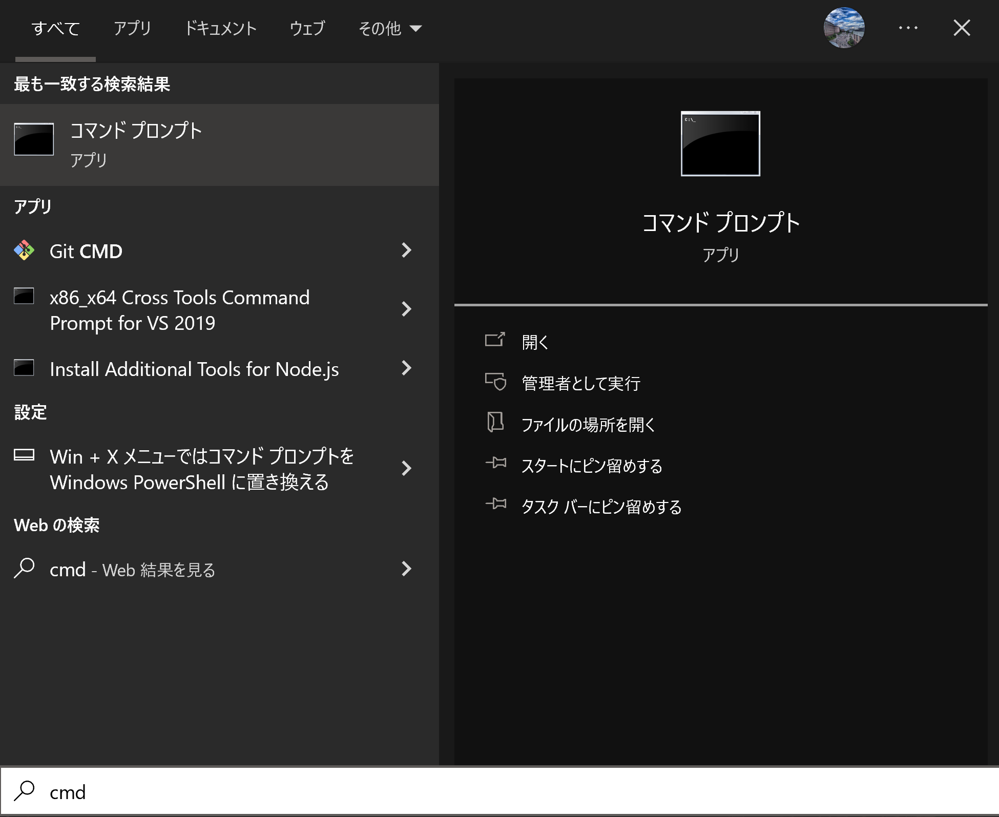
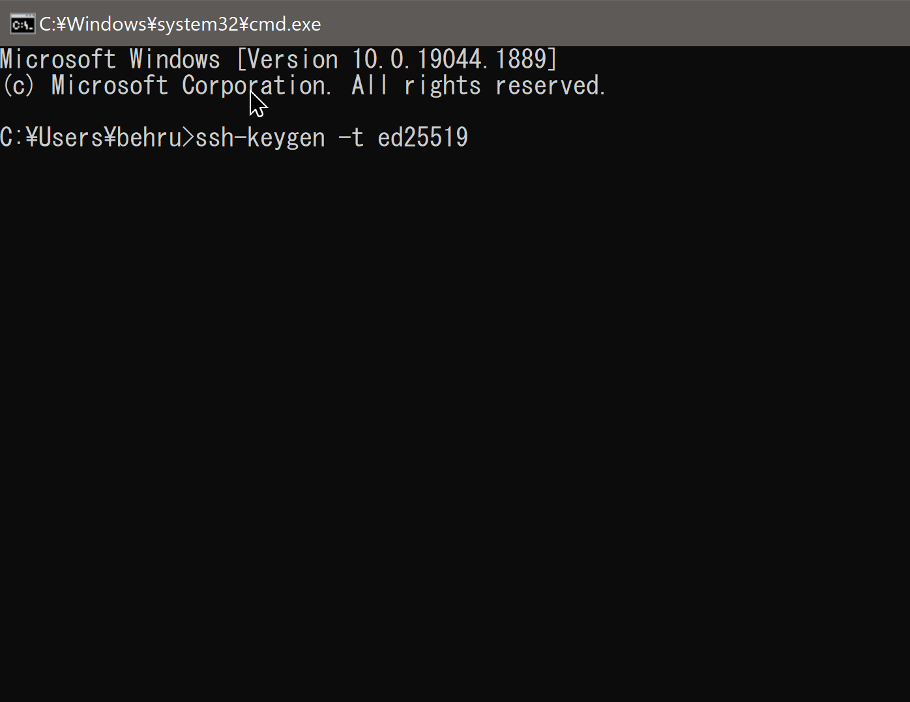
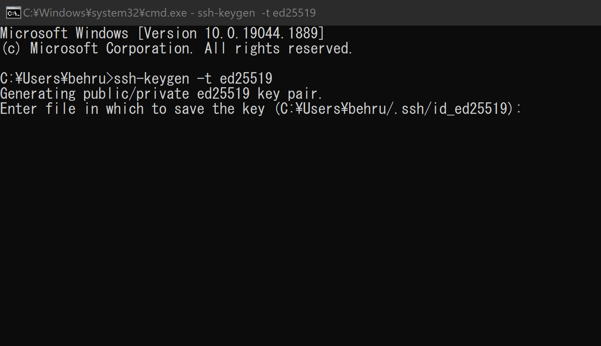

# OpenSSH
OpenSSH は、SSH プロトコルを使用したリモート ログイン用の主要な接続ツールです。 すべてのトラフィックを暗号化して、盗聴、接続ハイジャック、およびその他の攻撃を排除します。 さらに、OpenSSH は、安全なトンネリング機能、複数の認証方法、および洗練された構成オプションの大規模なスイートを提供します。

# セットアップ
1. OpenSSHはWindows PCに入っています。アクティベートするだけです。Windowsキーを押して、設定アイコンから設定画面に入ってください。`設定` => `アプリ` => `オプション機能` => `OpenSSH クライアント`をクリックしインストールされていることを確認ください。
   * インストールされているなら、アンインストールボタンが出ます。何もする必要がないです。下のステップを無視してください。
   * インストールされていない場合はインストールアイコンが出ます。インストールをクリックしてください。
   * [公式サイト](https://docs.microsoft.com/en-us/windows-server/administration/openssh/openssh_install_firstuse?tabs=gui#install-openssh-for-windows)  
    
2. Windowsキーを押して`service`と検索してください。`サービス`アイコンをクリックしてください。  
    
3. サービス画面でサービス一覧が表示されます。`Open SSH Authentication Agent`と`OpenSSH SSH Server`の両方上に右クリックし、`開始`を押してください。  
    

# SSHキーの作成方法
> 公式サイト：[新しいSSHキーの作成](https://docs.microsoft.com/en-us/windows-server/administration/openssh/openssh_keymanagement#host-key-generation) 　　
1. OpenSSHがセットアップされていることが条件です。[セットアップ](#セットアップ)に従ってください。
2. Windowsキーを押して、`cmd`と検索してください。`コマンドプロンプト`アイコンをクリックしてください。
    
3. コマンドプロンプトで以下のコマンドを打ってください：
  ```cmd
  ssh-keygen -t ed25519
  ```  
    
4. Enter file in which to save the keyに何も入力せずにEnterキーを押してください。  
    
5. Enter passphraseにも何も入力せず、Enterキーを押してください。2度も入力せず、Enterを押す。
6. こちらのフォルダーをファイルエクスプローラーで開いてください： [ファイルエクスプローラーを開く](file:///C:/%USERNAME%/.ssh/)