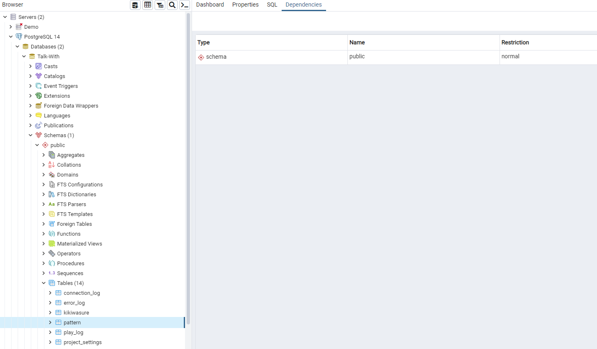
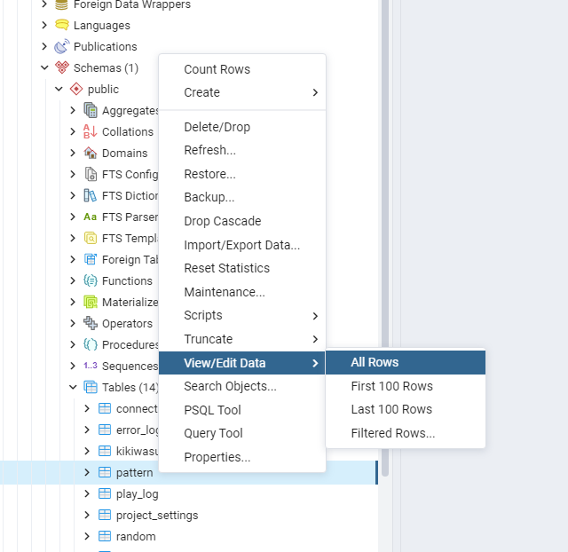
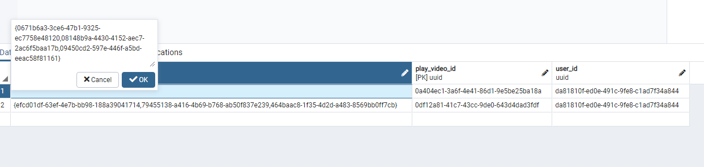
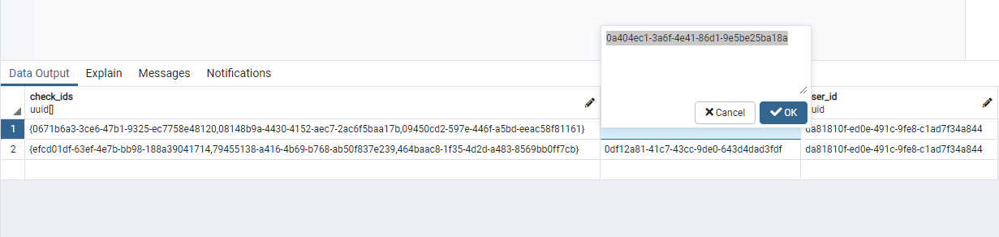
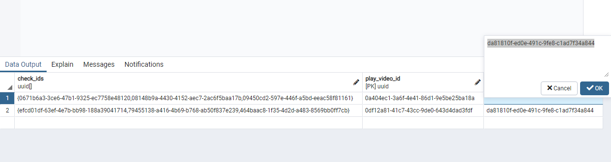

# ベタ－29: Patternとは

`ベタ－29: Pattern`とは、事前に決めたIDをすべて再生したときに、指定した映像が再生するようにする機能です。指定した映像が1回再生したら、指定した映像はもう再生しない。  
* 事前に決めたID : check_ids  
* 指定した映像 : play_video_id

# 例
二つのパタンがあるとした前提  

①　事前に決めたID : [ A, B, C ],  指定した映像 : D  
②　事前に決めたID : [ E, F, G ],  指定した映像 : H
  
  [ 流れ ] : `A映像再生` → `F映像再生` →  U映像再生 → `C映像再生` → R映像再生 → `B映像再生` → `D映像再生`(*) → A映像再生 → C映像再生→ `G映像再生`→ F映像再生 → B映像再生 → `E映像再生` → `H映像再生`(**)

  (*) この時点で ① はもう作動しない。  
  (**) この時点で ② はもう作動しない。  

# 使い方

1. pgAdminを立ち上げてpatternテーブルを探します。
   
2. patternテーブルを開きます。  
（patternを右クリック- View/Edit Data - All Rowsをクリック）
   
3. check_idsには事前に決める動画のIDを記入してください。様式は下記に従ってください。  
   様式 ； { 動画のID, 動画のID, 動画のID, ・・・ }
  
4. play_video_idにはcheck_idsの映像が再生し終わったら再生する動画のIDを記入してください。
   
5. user_idにはキャラクターのIDを記入してください。
   

# これから管理画面でも操作できるようにする予定