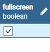

# show_speech_recognition_resultとは
`show_speech_recognition_result`とは、画面上でマイク及びテキストの表示/非表示を設定する機能です。

# 設定方法
1. pgAdmin4のアプリケーションを立ち上げます。
2. pgadminブラウザでtalk-withにあるproject_settingsテーブルを探して右クリックしてView/Edit DataのAllRowsをクリックします。      
   ( Servers - PostgreSQL - Databases - Talk-With - Schemas - public - Tables - project_settings )
   
3. `show_speech_recognition_result`の項目にチェックの有無で操作できます。チェックがし終わったらエンターをクリックしてください。（記入したい欄をダブルクリックすると編集ができます）  
   
4. F6ボタン又は画面上にあるボタン（下のイメージを参考）をクリックしたら保存できます。
  .png)
5. これで事前準備は完了しましたのでtalk-withアプリを立ち上げて確認します。
