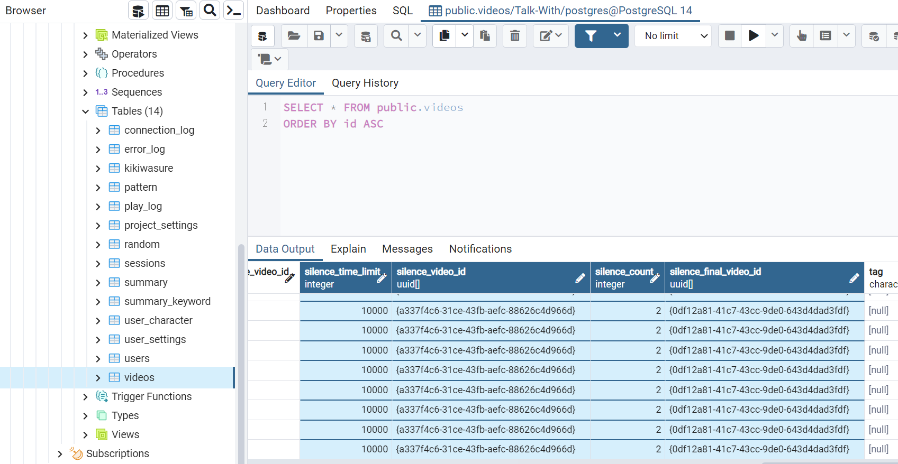
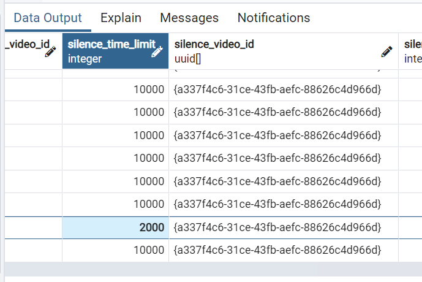
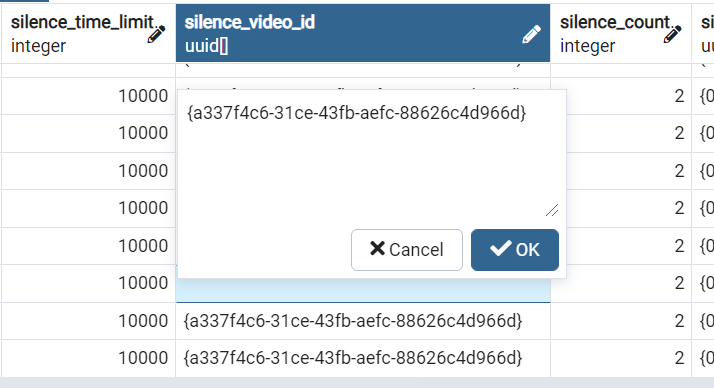
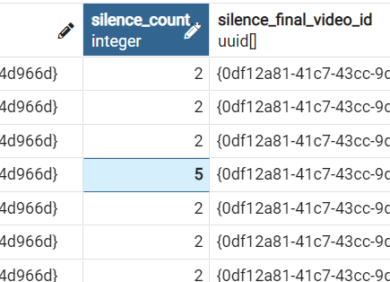
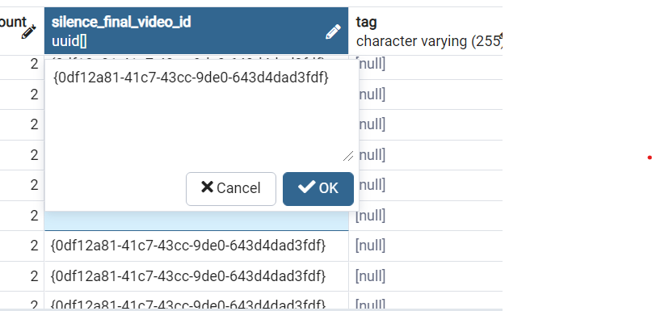
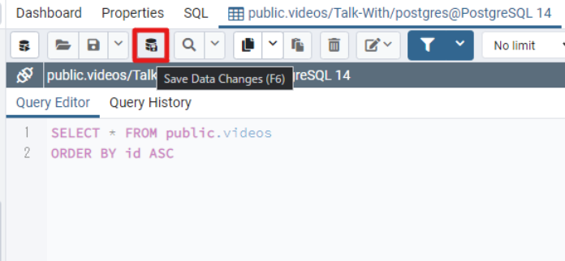

# ベタ－2、3：無言の設定（silence_limit）とは

`無言の設定（silence_limit）`とは、マイクがONになっているときに設定した時間以上無言が続くと事前に指定した動画を再生させる機能です。 動画別に無言の設定が可能です。 

# 項目の役割

*  `silence_time_limit`　:　無言の時間（単位：１秒 = 1000）ex) 10秒 = 10000
*  `silence_video_id`　:　無言の時間が経ったら再生させる無言の動画ID
*  `silence_count`　:　無言を何度繰り返すかの回数
*  `silence_final_video_id`　:　無言の動画IDが設定したカウンターの分だけ再生し終わったら再生させる最後の動画ID  

# 使い方
1. pgAdmin4のアプリケーションを立ち上げます。
2. pgadminブラウザでtalk-withにあるvideosテーブルを探して右クリックしてView/Edit DataのAllRowsをクリックします。    
  ( Servers - PostgreSQL - Databases - Talk-With - Schemas - public - Tables - videos )
  
  
3. `silence_time_limit`, `silence_video_id`, `silence_count`, `silence_final_video_id`の項目に下記のような型式でデータを記入します。記入がし終わったらOKボタンをクリック又はエンターを押してください。（記入したい欄をダブルクリックすると変更ができます）   
  [ `silence_time_limit` ]     
      
  [ `silence_video_id` ]    
      
  [ `silence_count` ]    
      
  [ `silence_final_video_id` ]    
      
4. F6ボタン又は画面上にあるボタン（下のイメージを参考）をクリックしたら保存できます。
      
5. これで事前準備は完了しましたのでtalk-withアプリを立ち上げて確認します。

  
