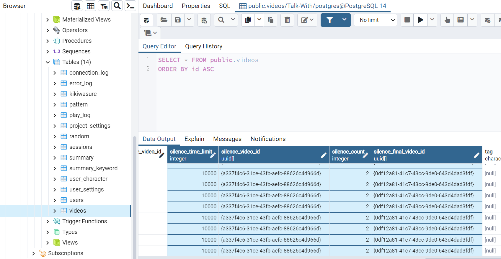
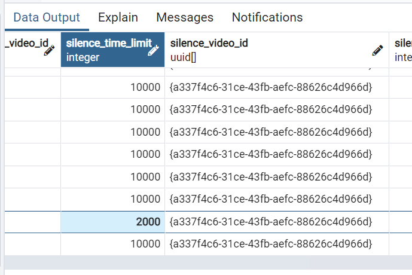
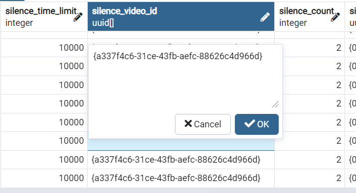
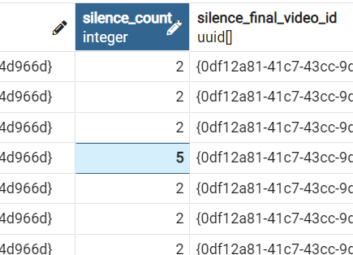
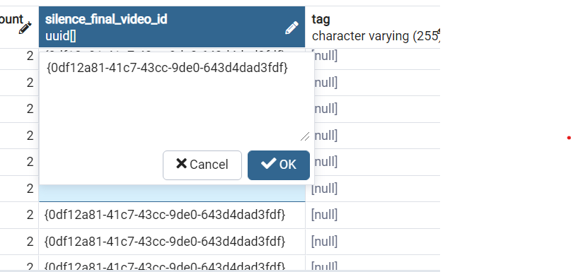
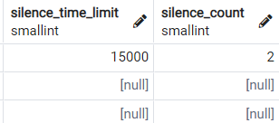
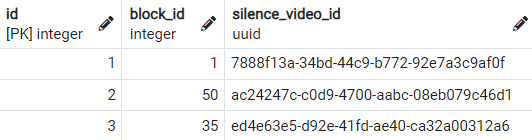
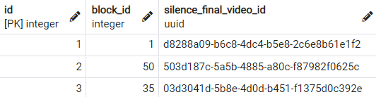

# （修正中： ブロック管理画面で設定てきるように）
# ベ－タ2：無言の設定とは　

`無言の設定`とは、マイクがONになっているときに設定した時間以上無言が続くと事前に指定した動画を再生させる機能です。 ブロックごとに及びキャラクターごとに無言の設定が可能です。（ブロックの方が優先） 

# データベース
### `blocks`のテーブル
* `silence_time_limit` : 無言の時間（単位：１秒 = 1000）ex) 10秒 = 10000  
* `silence_count` : 無言を何度繰り返すかの回数 (32767まで入力できます。)  

### `block_silence_videos`のテーブル
* `id` : sirial number (重複不可)
* `block_id` : blockのid
*  `silence_video_id`　:　無言の時間が経ったら再生させる無言の動画ID

### `block_silence_final_videos`のテーブル
* `id` : sirial number (重複不可)
* `block_id` : blockのid
*  `silence_final_video_id`　:　無言の動画IDが設定したカウンターの分だけ再生し終わったら再生させる最後の動画ID  

### `character_settings`のテーブル  
* `silence_time_limit` : 無言の時間（単位：１秒 = 1000）ex) 10秒 = 10000  
* `silence_count` : 無言を何度繰り返すかの回数 (32767まで入力できます。)  
*  `silence_video_id`　:　無言の時間が経ったら再生させる無言の動画ID  
*  `silence_final_video_id`　:　無言の動画IDが設定したカウンターの分だけ再生し終わったら再生させる最後の動画ID  
*  `silence_enabled` : trueの場合、silenceの機能が作動  

# 注意点
* 無言の機能のON/OFFはcharacter_settingsテーブルのsilence_enabledをtrue/falseで設定できます。（true : ON , false : OFF）
* 無言の設定はキャラクターごとの設定とブロックごとの設定ができます。
* ブッロクごとの設定が優先です。  
  (キャラクターごとの設定とブロックごとの設定、二つ全部あったらブロックごとの設定が作動)  

# 使い方
## character_settingsの方
1. pgAdmin4のアプリケーションを立ち上げます。
2. pgadminブラウザでtalk-withにあるcharacter_settingsテーブルを探して右クリックしてView/Edit DataのAllRowsをクリックします。    
  ( Servers - PostgreSQL - Databases - Talk-With - Schemas - public - Tables - character_settings )
  
  
3. `silence_time_limit`, `silence_video_id`, `silence_count`, `silence_final_video_id`の項目に下記のような型式でデータを記入します。記入がし終わったらOKボタンをクリック又はエンターを押してください。（記入したい欄をダブルクリックすると編集ができます）   
  [ `silence_time_limit` ]     
      
  [ `silence_video_id` ]    
      
  [ `silence_count` ]    
      
  [ `silence_final_video_id` ]    
      
4. F6ボタン又は画面上にあるボタン（下のイメージを参考）をクリックしたら保存できます。
  .png)    
5. これで事前準備は完了しましたのでtalk-withアプリを立ち上げて確認します。

## blocksの方
blockでのsilence設定は三つのテーブルで設定しなければならないです。  
（`blocks`, `block_silence_videos`, `block_silence_final_videos`）  
1. pgAdmin4のアプリケーションを立ち上げます。
2. pgadminブラウザでtalk-withにあるblocksテーブルを探して右クリックしてView/Edit DataのAllRowsをクリックします。    
  ( Servers - PostgreSQL - Databases - Talk-With - Schemas - public - Tables - blocks )
3. `blocks`テーブルでは"silence_time_limit", "silence_count"の設定ができます。  
  
4. `block_silence_videos`テーブルでは"silence_video_id"の設定ができます。  
* id : 記入しないでください。
* block_id : 該当するブロックIDを記入してください。  
    
5. `block_final_silence_videos`テーブルでは"silence_final_video_id"の設定ができます。  
* id : 記入しないでください。  
* block_id : 該当するブロックIDを記入してください。  
    
6. テーブルごとに設定がし終わった度に、F6ボタン又は画面上にあるボタン（下のイメージを参考）をクリックしたら保存できます。
  .png)  
7. これで事前準備は完了しましたのでtalk-withアプリを立ち上げて確認します。