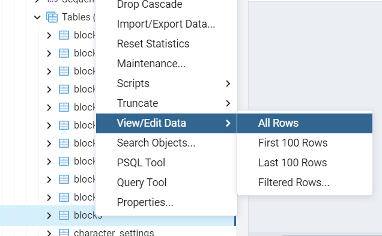
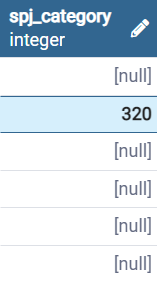
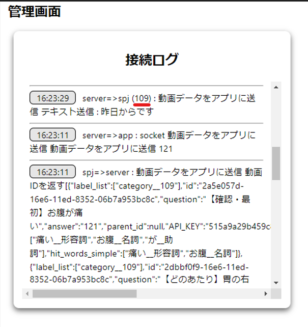

# spj_categoryとは
`spj_category`とは、spjのカテゴリ番号です。spj_categoryは `block`ごとに設定ができです。

# 流れ
### [動画ごとに設定した場合]
１．動画（spj_category:100）が再生している  
２．ユーザーが "昨日からです" と言ったら  
３．該当spj_categoryの "昨日からです" の回答動画を再生する。

# 設定方法 (動画ごとの設定)
1. pgAdmin4のアプリケーションを立ち上げます。
2. pgadminブラウザでtalk-withにあるvideosテーブルを探して右クリックしてView/Edit DataのAllRowsをクリックします。    
  ( Servers - PostgreSQL - Databases - Talk-With - Schemas - public - Tables - blocks )
  
3. `spj_category`の項目にカテゴリ番号を記入します。記入がし終わったらエンターを押してください。（記入したい欄をダブルクリックすると編集ができます）  
  
4. F6ボタン又は画面上にあるボタン（下のイメージを参考）をクリックしたら保存できます。
  .png)    
5. これで事前準備は完了しましたのでtalk-withアプリを立ち上げて確認します。

# 確認
* [管理画面](./page/admin_page/admin_page.md)（LIVEログ）から確認ができます。  
      

