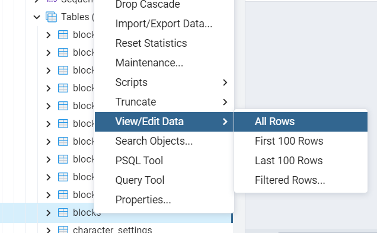

# tag(回答タグ)とは

`tag(回答タグ)`とは、blocksのデータの中にあるtagの項目に特定単語を設定すれば、ユーザーが言うとき、言った言葉に特定単語を含めてSPJに送る機能です。

# 例
[流れ]  
１．blocksのtag : 発熱  
２．ユーザーが言った言葉　：　昨日の夜から熱がありました。  
３．spjに送るときは　"【発熱】昨日の夜から熱がありました。" 、こういう風に送ります。

# 設定方法
1. pgAdmin4のアプリケーションを立ち上げます。
2. pgadminブラウザでtalk-withにあるblocksテーブルを探して右クリックしてView/Edit DataのAllRowsをクリックします。    
  ( Servers - PostgreSQL - Databases - Talk-With - Schemas - public - Tables - blocks )
  
3. `tag`の項目に特定単語を記入します。記入がし終わったらOKボタンをクリックしてください。（記入したい欄をダブルクリックすると編集ができます）  
  
4. F6ボタン又は画面上にあるボタン（下のイメージを参考）をクリックしたら保存できます。
  .png)    
5. これで事前準備は完了しましたのでtalk-withアプリを立ち上げて確認します。
