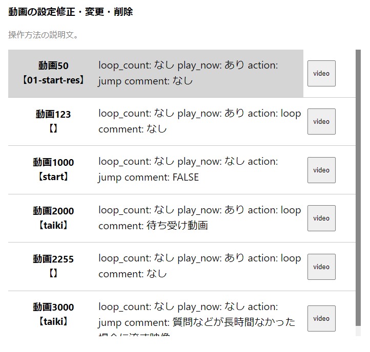
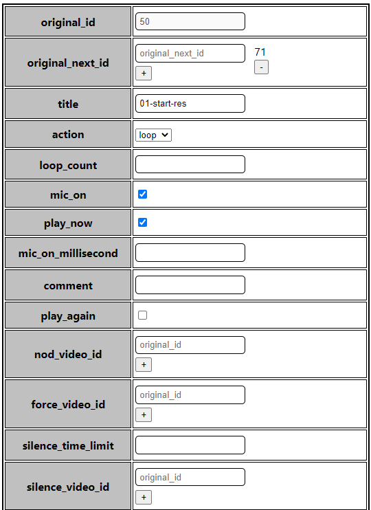
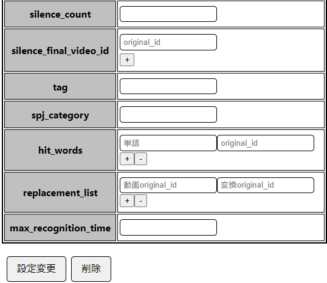

# 動画の設定修正・変更・削除
`動画の設定修正・変更・削除`とは、動画ごとのデータを修正・変更・削除する機能です。

# 流れ
１．キャラクター設定画面の下の方に動画の設定修正・変更・削除の欄があります。修正・変更・削除したい動画をクリックしてください。
    
２．クリックしたら、下のイメージのページが表示されます。修正・変更したい場合はデータを記入して設定変更ボタンを押してください。削除したい場合は削除ボタンを押してください。  
      
      
３．前のパージに戻るときは画面の上にある`前に戻る`ボタンを押してください。

# 使い方
* 動画IDを追加する項目はoriginal_idを入力して `+`を押すと追加されます。削除する場合は `-`ボタンを押してください。
* `spj_category`は必ず記入してください。
* `hit_words`、追加する場合は特定単語と特定単語の時流す動画のoriginal_idを記入して `+`ボタンを押してください。削除する場合は削除する単語を`単語`欄に記入して `-`ボタンを押してください。
* `replacement_list`、追加する場合は動画IDのoriginal_idを記入し、変換IDのoriginal_idを記入して`+`ボタンを押してください。削除する場合は削除する動画IDのoriginal_idを`動画original_id`欄に記入して `-`ボタンを押してください。
  