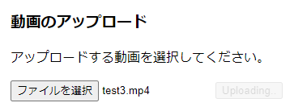
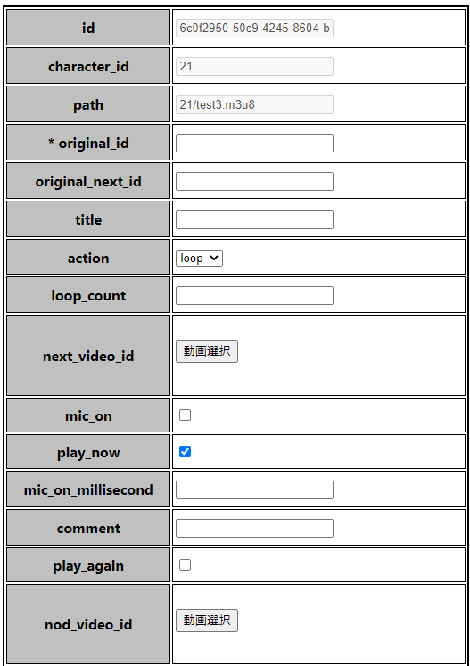
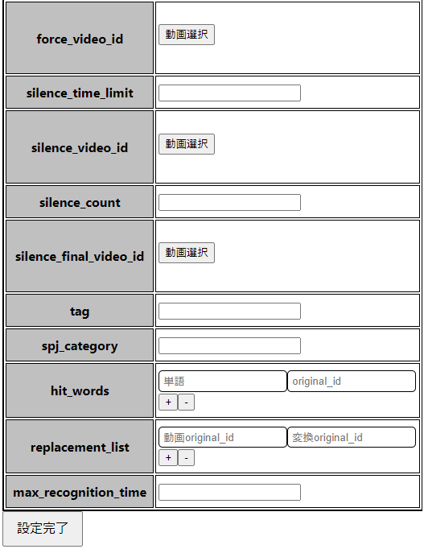
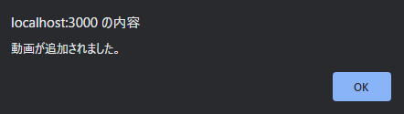

# 動画のアップロード
`動画のアップロード`とは、もう生成されているキャラクターがある場合、動画を追加する機能です。

# 注意点
  * アップロードしようとする動画の名ともうアップロードされている動画の名前が同じだったらアップロードできません。
  * original_idは必ず記入してください。

# 使い方
１．`ファイルを選択`をクリックしてアップロードしようとするファイルを選択します。（character_settings画面にあります。）  
    
２．`Upload`ボタンを押したら自動でhls変換されます。変換されているところだったら下のイメージように表示されます。  
    
３．hls変換が終わったら、動画のデータを入力する欄(下のイメージ)が表示されます。動画の情報を記入してください。  
    
    
４．記入が終わったら、下にある設定完了ボタンを押してください。下のパップアップが出てきたら動画アップロードは終わりです。  
    
