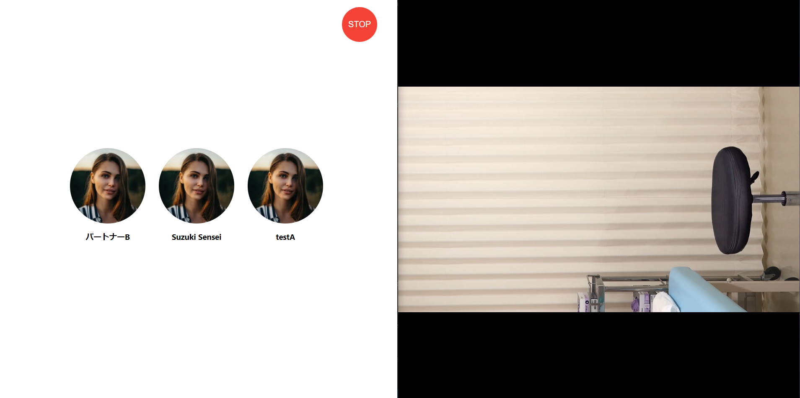

# On-Premiseモードの使い方
管理者のみtalk-withの操作ができるモードです。

一連の流れ：

1. /（ユーザー画面）では待機動画がループで流れる
2. /admin/controllerの画面も同時に立ち上げてください。
3. /admin/controller（管理者画面）でパートナー選択、/でそのパートナー用のスタート動画再生。会話開始。
4. ストップボタンで会話強制終了。/で待機動画がループ再生。

# 機能
* パートナー選択機能
* 会話強制終了ボタン（ストップボタン）

  
  左）コントローラー画面、右）ユーザー画面

# 待機動画設定方法

 

 project_settingsテーブルのstandby_video_idで待機動画を設定できます。