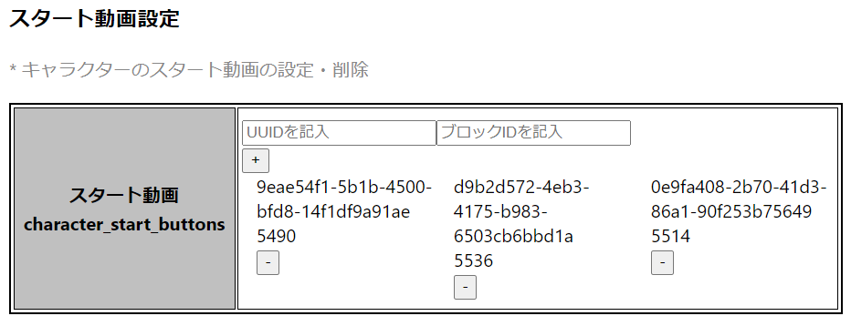
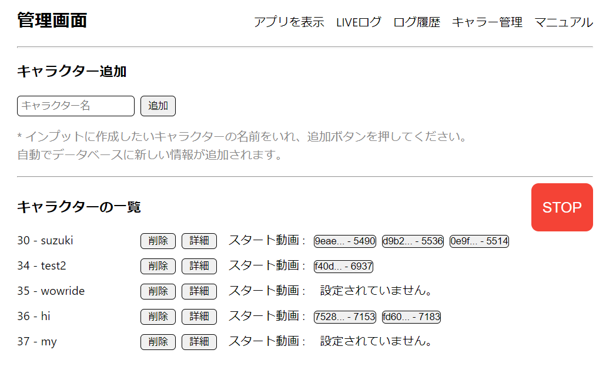

# スタートブロックの仕様・管理画面からの設定方法
`スタートブロックの仕様・管理画面からの設定方法`とは、キャラクターごとに複数のスタートボタンがあり、事前にユーザーが設定した動画を再生させることです。設定する項目ハ２つあり：
1. スタート動画
2. スタート動画の後に遷移するブロックのID

### データベース
* character_start_buttonsテーブル  
  項目|内容
  ----|----
  id|任意のシリアル番号  
  character_id|キャラクターID  
  video_id|動画ID  
  block_id|ブロックID  

# 流れ
１．スタートボタンを押す  
２．video_idの動画が流す  
３．video_idの動画が再生し終わったらブロックの動画(trigger_video_id)を再生させる

# 設定方法
１．キャラクターの詳細ページに入ります。  
  
２．詳細ページに`スタート動画設定`設定ができます。
  
３．動画IDとブロックIDを記入して、`+` ボタンを押してください。  
(注意点)  
* 動画IDとブッロクIDは必ず記入してください。  

４．削除する場合は、`-`ボタンを押してください。  
５．設定が終わったら、キャラー管理に戻ってください。  
  
６．キャラクターの一覧を見ると、キャラクターの右側にスタート動画のボタンが作られます。  
７．ボタンを押すと、該当動画の動画がユーザー画面で再生されます。動画を止まりたい時はキャラクターの一覧の右側にあるSTOPボタンを押してください。  

