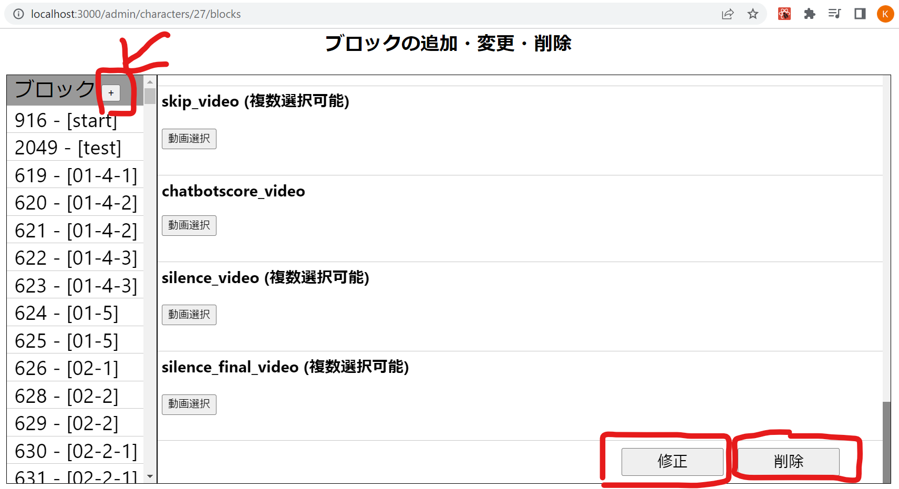

### ブロック一覧画面

ブロックの設定を追加・修正・削除することができます。

## ブロック修正・削除について

ブロックページに移動すると、左側に選択したキャラクターのブロック一覧、右側に選択したブロックの詳細が表示されます。動画選択ボタンを押すとキャラクターの動画一覧が表示されるので、チェックすると動画を設定することができます。右側のブロック設定画面を下にスクロールしていくと修正ボタンと削除ボタンがあります。
・タイトル
・キャラクター ID
・タグ
・トリガー動画
・聞き待ち動画
・invalid_max_count
・invalid_final 動画
・force_next 動画
・play_again
・play_final 動画
・音声最大認識時間（max_recoginition_time)
・spj_empty 動画（spj から返答ない時に流す動画）
・listen_video_number（聞き待ち動画の何番目に移動するかの番号）
・chatbot_score_end 動画
・silence_time_limit
・silence_count
・valid_response 動画
・invalid_response 動画
・hit_words
・replacement 動画
・nod 動画
・skip_video
・chatbot_score
・silence 動画
・silence_final 動画

複数動画設定できる項目
・listen_video
・valid_response
・invalid_response
・hit_words 　
・replacement_video 　
・nod_video
・skip_video
・chatbotscore_video
・silence_video

# listen_video の設定方法

1. 動画選択ボタンから動画を選択する。
2. 聞き動画の順番(play_order)を設定。＊聞き動画は１、2、3、、の順序で再生されます。
3. 保存ボタンをクリック。

# invalid_response の設定方法

1. 動画選択ボタンから動画を選択する。
2. invalid_response 動画を追加。
3. 聞き動画の何番目を再生するかの番号(listen_video_number)を設定。
4. 保存ボタンをクリック。

# silence_video の設定方法

1. 動画選択ボタンから動画を選択する。
2. silence_video 動画を追加。
3. 聞き動画の何番目を再生するかの番号(listen_video_number)を設定。
4. 保存ボタンをクリック。

# chatbotscore_video の設定方法

1. 動画選択ボタンから動画を選択する。
2. チャットボットスコアを追加。0.01 刻みで設定可能。
3. 聞き動画の何番目を再生するかの番号(listen_video_number)を設定。
4. 保存ボタンをクリック。

# replacement_video の設定方法

1. 動画選択ボタンから動画を選択する。
2. 変更後動画を再度動画選択ボタンから追加。
3. 保存ボタンをクリック。\*変更前動画のみ設定している場合、追加されないので注意してくだい。

## ブロック追加について

左側のブロック一覧の一番上にある+ボタンを押すと新しいブロックを作成する画面に移動します。機能を設定し、追加ボタンを押すとブロックが管理画面に追加されます。
