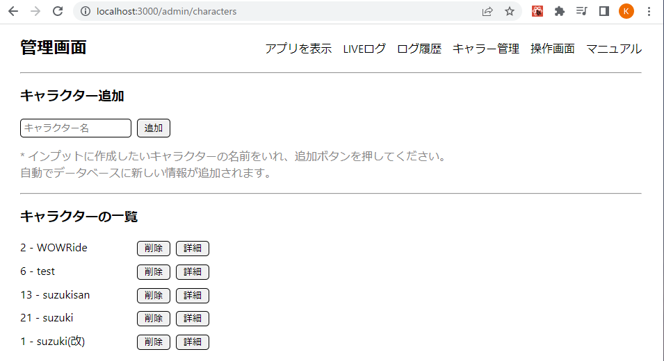
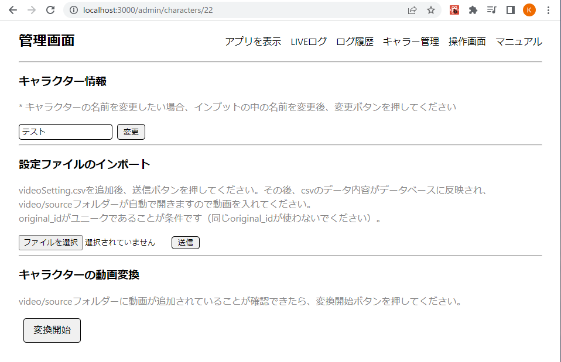
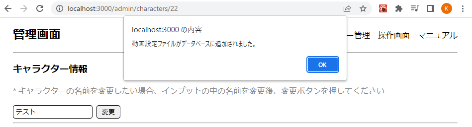
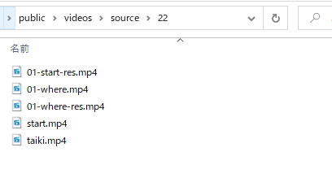
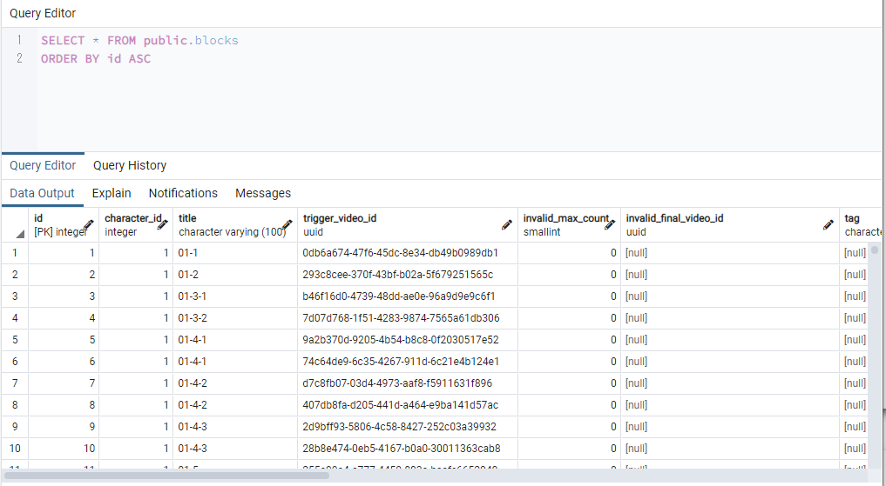
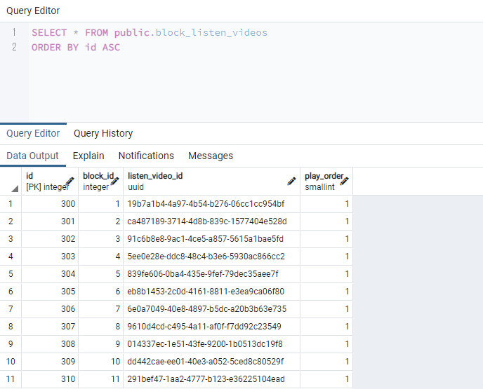
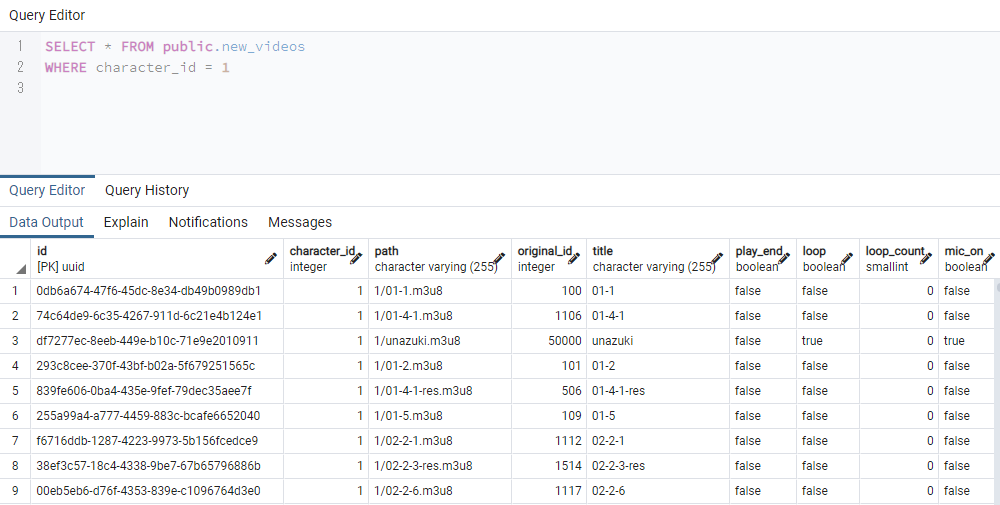

# ブロックの使い方

新しくキャラクターを作成する場合：

1. 管理画面 → キャラクター管理画面へ移動。
   
2. キャラクター追加後、詳細ボタンをクリック。
3. ファイルを選択して videoSetting.csv を送信。
   

4. 送信完了後、メッセージが表示される。
   
5. 4 と同じタイミングで、ファイルが立ち上がるので動画を入れる。
   
6. 変換ボタンをクリック。変換処理完了後、キャラクター管理画面へ自動で戻る。
7. データベース（blocks・block_listen_videos・new_videos）に情報が追加されていることを確認。
   
   
   

# ブロックの流れ

ブロック毎に対話を操作できるようになります。

1. ブロック入る前に play_again 確認
2. ブロックに入る
3. trigger_video 再生
4. 最初の聞き動画再生

<テキストを spj に送る前>

1. hit_words 再生

<spj レスポンス後>

1. スコアが低かったら chatbot score 再生
2. skip_id を確認
3. replacement リストを確認
4. valid_response を確認
5. invalid_response を確認
